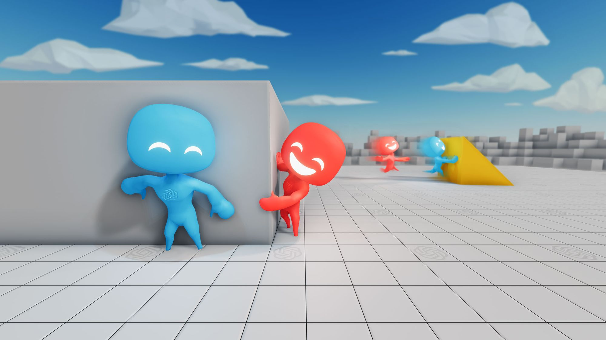
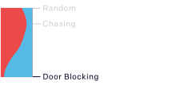
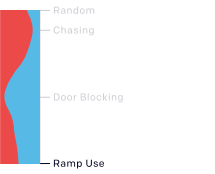
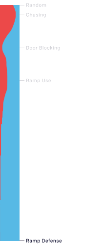
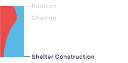
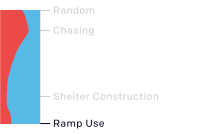
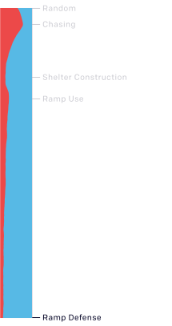
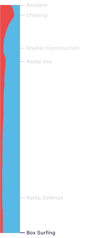
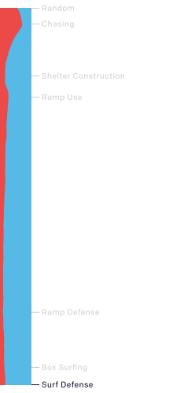

# Emergent Tool Use from Multi-Agent Interaction

## Summary

We've observed agents discovering progressively more complex tool use while playing a simple game of hide-and-seek.

## Content

<!--kg-card-begin: markdown-->

We've observed agents discovering progressively more complex tool use while playing a simple game of hide-and-seek. Through training in our new simulated hide-and-seek environment, agents build a series of six distinct strategies and counterstrategies, some of which we did not know our environment supported. The self-supervised emergent complexity in this simple environment further suggests that multi-agent co-adaptation may one day produce extremely complex and intelligent behavior.

<section class="btns"><a class="btn btn-padded icon-paper" href="https://arxiv.org/abs/1909.07528">Paper</a><a class="btn btn-padded icon-code" href="https://github.com/openai/multi-agent-emergence-environments">Environment Generation</a><a class="btn btn-padded icon-code" href="https://github.com/openai/mujoco-worldgen">Worldgen</a></section>

In our environment, agents play a team-based hide-and-seek game. Hiders (blue) are tasked with avoiding line-of-sight from the seekers (red), and seekers are tasked with keeping vision of the hiders. There are objects scattered throughout the environment that hiders and seekers can grab and lock in place, as well as randomly generated immovable rooms and walls that agents must learn to navigate. Before the game begins, hiders are given a preparation phase where seekers are immobilized to give hiders a chance to run away or change their environment.

<!-- 0a -->
<figure class="col-12 col-sm-6 col-md-4 col-xl mb-xl-0">
<iframe allow="autoplay; fullscreen" allowfullscreen="" class="js-custom-lazy" data-id="0a" data-src="https://player.vimeo.com/video/354948714?autopause=0&amp;autoplay=0&amp;background=1&amp;loop=1&amp;muted=1&amp;playsinline=1&amp;transparent=1" data-video="" frameborder="0" height="360" width="640"></iframe>
<figcaption class="mt-0">
The agents can <strong class="color-fg">move</strong> by setting a force on themselves in the x and y directions as well as rotate along the z-axis.
</figcaption>
</figure>
<!-- 0b -->
<figure class="col-12 col-sm-6 col-md-4 col-xl mb-xl-0">
<iframe allow="autoplay; fullscreen" allowfullscreen="" class="js-custom-lazy" data-id="0b" data-src="https://player.vimeo.com/video/354948732?autopause=0&amp;autoplay=0&amp;background=1&amp;loop=1&amp;muted=1&amp;playsinline=1&amp;transparent=1" data-video="" frameborder="0" height="360" width="640"></iframe>
<figcaption class="mt-0">
The agents can <strong class="color-fg">see</strong> objects in their line of sight and within a frontal cone.
</figcaption>
</figure>
<!-- 0c -->
<figure class="col-12 col-sm-6 col-md-4 col-xl mb-xl-0">
<iframe allow="autoplay; fullscreen" allowfullscreen="" class="js-custom-lazy" data-id="0c" data-src="https://player.vimeo.com/video/354948741?autopause=0&amp;autoplay=0&amp;background=1&amp;loop=1&amp;muted=1&amp;playsinline=1&amp;transparent=1" data-video="" frameborder="0" height="360" width="640"></iframe>
<figcaption class="mt-0">
The agents can <strong class="color-fg">sense</strong> distance to objects, walls, and other agents around them using a lidar-like sensor.
</figcaption>
</figure>
<!-- 0d -->
<figure class="col-12 col-sm-6 col-md-4 col-xl mb-xl-0">
<iframe allow="autoplay; fullscreen" allowfullscreen="" class="js-custom-lazy" data-id="0d" data-src="https://player.vimeo.com/video/354948752?autopause=0&amp;autoplay=0&amp;background=1&amp;loop=1&amp;muted=1&amp;playsinline=1&amp;transparent=1" data-video="" frameborder="0" height="360" width="640"></iframe>
<figcaption class="mt-0">
The agents can <strong class="color-fg">grab and move</strong> objects in front of them.
</figcaption>
</figure>
<!-- 0e -->
<figure class="col-12 col-sm-6 col-md-4 col-xl mb-xl-0">
<iframe allow="autoplay; fullscreen" allowfullscreen="" class="js-custom-lazy" data-id="0e" data-src="https://player.vimeo.com/video/354948766?autopause=0&amp;autoplay=0&amp;background=1&amp;loop=1&amp;muted=1&amp;playsinline=1&amp;transparent=1" data-video="" frameborder="0" height="360" width="640"></iframe>
<figcaption class="mt-0">
The agents can <strong class="color-fg">lock</strong> objects in place. Only the team that locked an object can unlock it.
</figcaption>
</figure>

<!-- end .row -->

<!-- end .wide -->

There are no explicit incentives for agents to interact with objects in the environment; the only supervision given is through the hide-and-seek objective. Agents are given a team-based reward; hiders are given a reward of <samp>+1</samp> if all hiders are hidden and <samp>-1</samp> if any hider is seen by a seeker. Seekers are given the opposite reward, <samp>-1</samp> if all hiders are hidden and <samp>+1</samp> otherwise. To confine agent behavior to a reasonable space, agents are penalized if they go too far outside the play area. During the preparation phase, all agents are given zero reward.

<h2 id="autocurriculaandemergentbehavior">Autocurricula and emergent behavior</h2>

As agents train against each other in hide-and-seek, <strong>as many as six distinct strategies emerge</strong>. Each new strategy creates a previously nonexistent pressure for agents to progress to the next stage. Note that there are no direct incentives for agents to interact with objects or to explore; rather, the emergent strategies shown below are a result of the <em><a href="https://arxiv.org/pdf/1903.00742.pdf">autocurriculum</a></em> induced by multi-agent competition and the simple dynamics of hide-and-seek.

<!-- interactive emergence module -->

<h3 id="emergenceinasimpleenvironment">Emergence in a simple environment</h3>

We first show emergent strategies learned in a simple environment with 2 hiders, 2 seekers, 2 boxes, 1 ramp, and a room that has between 1–2 randomly placed doors.

<h6 class="mt-0 mb-1/12">Rewards per episode</h6>

Seekers

Hiders

Games played right

<figure class="mb-0.5 mb-md-2 pt-1.25" data-monitor="" id="simple-random">
<iframe allow="autoplay; fullscreen" allowfullscreen="" class="js-custom-lazy" data-id="1a" data-src="https://player.vimeo.com/video/355207231?autopause=0&amp;autoplay=0&amp;background=1&amp;loop=1&amp;muted=1&amp;playsinline=1&amp;transparent=1" data-video="" frameborder="0" height="360" width="640"></iframe>
<footer class="max-width-narrow mt-0.5">

Episode 0

<strong class="color-fg">Random</strong> The agents move randomly.

</footer>
</figure>

<figure class="mb-0.5 mb-md-2 pt-1.25" data-monitor="" id="simple-chasing">
<iframe allow="autoplay; fullscreen" allowfullscreen="" class="js-custom-lazy" data-id="1b" data-src="https://player.vimeo.com/video/355207253?autopause=0&amp;autoplay=0&amp;background=1&amp;loop=1&amp;muted=1&amp;playsinline=1&amp;transparent=1" data-video="" frameborder="0" height="360" width="640"></iframe>
<footer class="max-width-narrow mt-0.5">

Episodes 0–2.69 million

<strong class="color-fg">Chasing</strong> Seekers learn to chase hiders.

</footer>
</figure>

<figure class="mb-0.5 mb-md-2 pt-1.25" data-monitor="" id="simple-door-blocking">
<iframe allow="autoplay; fullscreen" allowfullscreen="" class="js-custom-lazy" data-id="1c" data-src="https://player.vimeo.com/video/355207259?autopause=0&amp;autoplay=0&amp;background=1&amp;loop=1&amp;muted=1&amp;playsinline=1&amp;transparent=1" data-video="" frameborder="0" height="360" width="640"></iframe>
<footer class="max-width-narrow mt-0.5">

Episodes 2.69–8.62 million

<strong class="color-fg">Door Blocking</strong> Hiders learn to grab and move boxes to block the doors.

</footer>
</figure>

<figure class="mb-0.5 mb-md-2 pt-1.25" data-monitor="" id="simple-ramp-use">
<iframe allow="autoplay; fullscreen" allowfullscreen="" class="js-custom-lazy" data-id="1d" data-src="https://player.vimeo.com/video/355207273?autopause=0&amp;autoplay=0&amp;background=1&amp;loop=1&amp;muted=1&amp;playsinline=1&amp;transparent=1" data-video="" frameborder="0" height="360" width="640"></iframe>
<footer class="max-width-narrow mt-0.5">

Episodes 8.62–14.5 million

<strong class="color-fg">Ramp Use</strong> Seekers learn to use the ramp to jump over obstacles.

</footer>
</figure>

<figure class="mb-0.5 mb-md-2 pt-1.25" data-monitor="" id="simple-ramp-defense">
<iframe allow="autoplay; fullscreen" allowfullscreen="" class="js-custom-lazy" data-id="1e" data-src="https://player.vimeo.com/video/355207282?autopause=0&amp;autoplay=0&amp;background=1&amp;loop=1&amp;muted=1&amp;playsinline=1&amp;transparent=1" data-video="" frameborder="0" height="360" width="640"></iframe>
<footer class="max-width-narrow mt-0.5">

Episodes 14.5–43.4 million

<strong class="color-fg">Ramp Defense</strong> Hiders learn to move the ramp inside the room to prevent seekers from using it.

</footer>
</figure>
<figure class="mb-0 pt-1.25" data-monitor="" id="simple-ramp-defense">
<iframe allow="autoplay; fullscreen" allowfullscreen="" class="js-custom-lazy" data-id="1f" data-src="https://player.vimeo.com/video/355207292?autopause=0&amp;autoplay=0&amp;background=1&amp;loop=1&amp;muted=1&amp;playsinline=1&amp;transparent=1" data-video="" frameborder="0" height="360" width="640"></iframe>
<footer class="max-width-narrow mt-0.5">

Additionally, hiders learn to <strong class="color-fg">coordinate</strong> who will block which door and who will go grab the ramp. In cases where the boxes are far from the doors, hiders <strong class="color-fg">pass boxes to each other</strong> in order to block the doors in time.

</footer>
</figure>

<!-- end .col -->

<!-- end .row -->

<h3 id="emergenceinthefullenvironment">Emergence in the full environment</h3>

Next, we show emergent strategies learned in an environment with far more randomization, including 1–3 hiders, 1–3 seekers, 3–9 blocks, 2 ramps, and randomized rooms and doors. In this full environment, agents go through two more phases of emergent strategy than in the previous simple environment.

<h6 class="mt-0 mb-1/12">Rewards per episode</h6>

Seekers

Hiders

Games played right

<figure class="mb-0.5 mb-md-2 pt-1.25" data-monitor="" id="full-random">
<iframe allow="autoplay; fullscreen" allowfullscreen="" class="js-custom-lazy" data-id="2a" data-src="https://player.vimeo.com/video/355211280?autopause=0&amp;autoplay=0&amp;background=1&amp;loop=1&amp;muted=1&amp;playsinline=1&amp;transparent=1" data-video="" frameborder="0" height="360" width="640"></iframe>
<footer class="max-width-narrow mt-0.5">

Episode 0

<strong class="color-fg">Random</strong> The agents move randomly.

</footer>
</figure>

<figure class="mb-0.5 mb-md-2 pt-1.25" data-monitor="" id="full-chasing">
<iframe allow="autoplay; fullscreen" allowfullscreen="" class="js-custom-lazy" data-id="2b" data-src="https://player.vimeo.com/video/355211288?autopause=0&amp;autoplay=0&amp;background=1&amp;loop=1&amp;muted=1&amp;playsinline=1&amp;transparent=1" data-video="" frameborder="0" height="360" width="640"></iframe>
<footer class="max-width-narrow mt-0.5">

Episodes 0–22 million

<strong class="color-fg">Chasing</strong> Seekers learn to chase hiders.

</footer>
</figure>

<figure class="mb-0.5 mb-md-2 pt-1.25" data-monitor="" id="full-shelter-construction">
<iframe allow="autoplay; fullscreen" allowfullscreen="" class="js-custom-lazy" data-id="2c" data-src="https://player.vimeo.com/video/355211305?autopause=0&amp;autoplay=0&amp;background=1&amp;loop=1&amp;muted=1&amp;playsinline=1&amp;transparent=1" data-video="" frameborder="0" height="360" width="640"></iframe>
<footer class="max-width-narrow mt-0.5">

Episodes 22–88 million

<strong class="color-fg">Shelter Construction</strong> Hiders learn to construct a shelter to hide in.

</footer>
</figure>

<figure class="mb-0.5 mb-md-2 pt-1.25" data-monitor="" id="full-ramp-use">
<iframe allow="autoplay; fullscreen" allowfullscreen="" class="js-custom-lazy" data-id="2d" data-src="https://player.vimeo.com/video/355211318?autopause=0&amp;autoplay=0&amp;background=1&amp;loop=1&amp;muted=1&amp;playsinline=1&amp;transparent=1" data-video="" frameborder="0" height="360" width="640"></iframe>
<footer class="max-width-narrow mt-0.5">

Episodes 88–115 million

<strong class="color-fg">Ramp Use</strong> Seekers learn to use ramps to jump over obstacles.

</footer>
</figure>

<figure class="mb-0.5 mb-md-2 pt-1.25" data-monitor="" id="full-ramp-defense">
<iframe allow="autoplay; fullscreen" allowfullscreen="" class="js-custom-lazy" data-id="2e" data-src="https://player.vimeo.com/video/355211334?autopause=0&amp;autoplay=0&amp;background=1&amp;loop=1&amp;muted=1&amp;playsinline=1&amp;transparent=1" data-video="" frameborder="0" height="360" width="640"></iframe>
<footer class="max-width-narrow mt-0.5">

Episodes 115–388 million

<strong class="color-fg">Ramp Defense</strong> Hiders learn to lock the ramps to prevent seekers from using them.

</footer>
</figure>

<figure class="mb-0.5 mb-md-2 pt-1.25" data-monitor="" id="full-box-surfing">
<iframe allow="autoplay; fullscreen" allowfullscreen="" class="js-custom-lazy" data-id="2f" data-src="https://player.vimeo.com/video/355211341?autopause=0&amp;autoplay=0&amp;background=1&amp;loop=1&amp;muted=1&amp;playsinline=1&amp;transparent=1" data-video="" frameborder="0" height="360" width="640"></iframe>
<footer class="max-width-narrow mt-0.5">

Episodes 388–458 million

<strong class="color-fg">Box Surfing</strong> Seekers learn to bring a box to a locked ramp in order to jump on top of the box and then "surf" it to the hider's shelter. Box surfing is possible due to agents’ actuation mechanism, which allows them to apply a force on themselves regardless of whether they are on the ground or not.

</footer>
</figure>

<figure class="mb-0 pt-1.25" data-monitor="" id="full-surf-defense">
<iframe allow="autoplay; fullscreen" allowfullscreen="" class="js-custom-lazy" data-id="2g" data-src="https://player.vimeo.com/video/355211351?autopause=0&amp;autoplay=0&amp;background=1&amp;loop=1&amp;muted=1&amp;playsinline=1&amp;transparent=1" data-video="" frameborder="0" height="360" width="640"></iframe>
<footer class="max-width-narrow mt-0.5">

Episodes 458–481 million

<strong class="color-fg">Surf Defense</strong> Hiders learn to lock all ramps and boxes to prevent box surfing.

</footer>
</figure>

<!-- end .col -->

<!-- end .row -->

<!-- end .container -->

<!-- end .full -->
<h2 id="traininghideandseekagents">Training hide-and-seek agents</h2>

We use the same training infrastructure and algorithms used to train <a href="https://openai.com/blog/openai-five/">OpenAI Five</a> and <a href="https://openai.com/blog/learning-dexterity">Dactyl</a>. However, in our environment each agent acts independently, using its own observations and hidden memory state. Agents use an entity-centric state-based representation of the world, which is <em>permutation invariant</em> with respect to objects and other agents.

Each object is embedded and then passed through a masked residual self attention block, similar to those used in <a href="https://arxiv.org/pdf/1706.03762.pdf">transformers</a>, where the attention is over objects instead of over time. Objects that are not in line-of-sight and in front of the agent are masked out such that the agent has no information of them.

Agent policies are trained with <a href="https://openai.com/blog/competitive-self-play/">self-play</a> and <a href="https://openai.com/blog/openai-baselines-ppo/">Proximal Policy Optimization</a>. During optimization, agents can use privileged information about obscured objects and other agents in their value function.

We found that large scale training was critical in agents progressing through the various stages of emergence. Below we show both the time and number of episodes it takes agents to reach stage 4 (ramp defense) for various batch sizes. We find increasing batch size gives a drastic speedup in wall-clock time to convergence, though doesn’t affect the sample efficiency greatly at or above 32k. However, we found that batch sizes of 8k and 16k never reached stage 4 in the allotted number of episodes.

<figure class="my-1.5">
<h5 id="increasingbatchsizespeedsuptimetoconvergence">Increasing batch size speeds up time to convergence</h5>

<figcaption class="mt-0">Note: We report batch size in number of contiguous chunks of transitions used in backpropagation through time, each of which contains 10 transitions, meaning that a reported batch size of 64k actually contains 640k transitions.</figcaption>
</figure>
<h2 id="multiagentcompetitionvsintrinsicmotivation">Multi-agent competition vs. intrinsic motivation</h2>

In this work we show evidence that agents learn complex strategies and counterstrategies through a self-supervised autocurriculum in hide-and-seek. Another method to learn skills in an unsupervised manner is <em>intrinsic motivation</em>, which incentivizes agents to explore with various metrics such as model error or state counts. We ran count-based exploration in our environment, in which agents keep an explicit count of states they’ve visited and are incentivized to go to infrequently visited states. The primary modeling choice to tune in this setting is the state representation; for instance, in our first baseline we only include 2-D box positions in the state, such that agents are only incentivized to interact with and move boxes to novel positions. We then compare this to a count-based policy which takes the full state given to the agents that play hide-and-seek.

<!-- 3a -->
<figure class="col-12 col-sm-6 col-lg mb-1 mb-lg-0">
<iframe allow="autoplay; fullscreen" allowfullscreen="" class="js-custom-lazy" data-id="3a" data-src="https://player.vimeo.com/video/355000593?autopause=0&amp;autoplay=0&amp;background=1&amp;loop=1&amp;muted=1&amp;playsinline=1&amp;transparent=1" data-video="" frameborder="0" height="360" width="640"></iframe>
<figcaption class="mt-0">
<strong class="color-fg">Multi-agent</strong>
</figcaption>
</figure>
<!-- 3b -->
<figure class="col-12 col-sm-6 col-lg mb-1 mb-lg-0">
<iframe allow="autoplay; fullscreen" allowfullscreen="" class="js-custom-lazy" data-id="3b" data-src="https://player.vimeo.com/video/355000600?autopause=0&amp;autoplay=0&amp;background=1&amp;loop=1&amp;muted=1&amp;playsinline=1&amp;transparent=1" data-video="" frameborder="0" height="360" width="640"></iframe>
<figcaption class="mt-0">
<strong class="color-fg">Count-based exploration</strong> with selected observations
</figcaption>
</figure>
<!-- 3c -->
<figure class="col-12 col-sm-6 col-lg mb-1 mb-lg-0">
<iframe allow="autoplay; fullscreen" allowfullscreen="" class="js-custom-lazy" data-id="3c" data-src="https://player.vimeo.com/video/355000603?autopause=0&amp;autoplay=0&amp;background=1&amp;loop=1&amp;muted=1&amp;playsinline=1&amp;transparent=1" data-video="" frameborder="0" height="360" width="640"></iframe>
<figcaption class="mt-0">
<strong class="color-fg">Count-based exploration</strong> with full observations
</figcaption>
</figure>

<!-- end .row -->

<!-- end .wide -->

As can be seen, agents trained in hide-and-seek qualitatively center around far more human interpretable behaviors such as shelter construction, whereas agents trained with intrinsic motivation move objects around in a seemingly undirected fashion. Furthermore, as the state space increases in complexity, we find that intrinsic motivation methods have less and less meaningful interactions with the objects in their environment. For this reason, we believe multi-agent competition will be a more scalable method for generating human-relevant skills in an unsupervised manner as environments continue to increase in size and complexity.

<h2 id="transferandfinetuningasevaluation">Transfer and fine-tuning as evaluation</h2>

In the previous section, we qualitatively compare behaviors learned in hide-and-seek to those learned with intrinsic motivation. However, as environments increase in scale, so will the difficulty in qualitatively measuring progress. Tracking reward is an insufficient evaluation metric in multi-agent settings, as it can be ambiguous in indicating whether agents are improving evenly or have stagnated. Metrics like ELO or Trueskill can more reliably measure whether performance is improving relative to previous policy versions or other policies in a population; however, these metrics still do not give insight into whether improved performance is caused by new adaptations or improving previously learned skills. Finally, using environment-specific statistics such as object movement can also be ambiguous (for example, the choice to track absolute movement does not illuminate which direction agents moved), and designing sufficient metrics will become difficult and costly as environments scale.

We propose using a suite of domain-specific intelligence tests that target capabilities we believe agents may eventually acquire. Transfer performance in these settings can act as a quantitative measure of representation quality or skill, and we compare against pretraining with count-based exploration as well as a trained from scratch baseline.

<!-- skill charts -->

<!-- 4a -->
<figure class="col-12 col-sm-6 col-md-4 col-xl mb-1.75">

<figcaption class="mt-0 mb-0.75">
<strong class="color-fg">Object counting</strong> The agent is pinned in place and asked to predict how many objects have gone right or left, testing the agent's memory and sense of object permanence.
</figcaption>

<iframe allow="autoplay; fullscreen" allowfullscreen="" class="js-custom-lazy" data-id="4a" data-src="https://player.vimeo.com/video/354992084?autopause=0&amp;autoplay=0&amp;background=1&amp;loop=1&amp;muted=1&amp;playsinline=1&amp;transparent=1" data-video="" frameborder="0" height="360" width="640"></iframe>

</figure>
<!-- 4b -->
<figure class="col-12 col-sm-6 col-md-4 col-xl mb-1.75">

<figcaption class="mt-0 mb-0.75">
<strong class="color-fg">Lock and return</strong> The agent must find the box, lock it, and return to its original position, which tests the agent’s long term memory of its location.
</figcaption>

<iframe allow="autoplay; fullscreen" allowfullscreen="" class="js-custom-lazy" data-id="4b" data-src="https://player.vimeo.com/video/354992092?autopause=0&amp;autoplay=0&amp;background=1&amp;loop=1&amp;muted=1&amp;playsinline=1&amp;transparent=1" data-video="" frameborder="0" height="360" width="640"></iframe>

</figure>
<!-- 4c -->
<figure class="col-12 col-sm-6 col-md-4 col-xl mb-1.75">

<figcaption class="mt-0 mb-0.75">
<strong class="color-fg">Sequential lock</strong> The agent must lock boxes in an order unobserved to the agent. Boxes can only be locked in the correct order, so the agent must remember the status of boxes it has seen.
</figcaption>

<iframe allow="autoplay; fullscreen" allowfullscreen="" class="js-custom-lazy" data-id="4c" data-src="https://player.vimeo.com/video/354992105?autopause=0&amp;autoplay=0&amp;background=1&amp;loop=1&amp;muted=1&amp;playsinline=1&amp;transparent=1" data-video="" frameborder="0" height="360" width="640"></iframe>

</figure>
<!-- 4d -->
<figure class="col-12 col-sm-6 col-md-4 col-xl mb-1.75">

<figcaption class="mt-0 mb-0.75">
<strong class="color-fg">Blueprint construction</strong> The agent must move boxes to the target locations.
</figcaption>

<iframe allow="autoplay; fullscreen" allowfullscreen="" class="js-custom-lazy" data-id="4d" data-src="https://player.vimeo.com/video/354992114?autopause=0&amp;autoplay=0&amp;background=1&amp;loop=1&amp;muted=1&amp;playsinline=1&amp;transparent=1" data-video="" frameborder="0" height="360" width="640"></iframe>

</figure>
<!-- 4e -->
<figure class="col-12 col-sm-6 col-md-4 col-xl mb-1.75">

<figcaption class="mt-0 mb-0.75">
<strong class="color-fg">Shelter construction</strong> The agent must construct a shelter around the cylinder.
</figcaption>

<iframe allow="autoplay; fullscreen" allowfullscreen="" class="js-custom-lazy" data-id="4e" data-src="https://player.vimeo.com/video/354992122?autopause=0&amp;autoplay=0&amp;background=1&amp;loop=1&amp;muted=1&amp;playsinline=1&amp;transparent=1" data-video="" frameborder="0" height="360" width="640"></iframe>

</figure>

<!-- end .row -->

<!-- end .wide -->

Though the hide-and-seek agent performs better on many of the transfer tasks, it does not drastically improve performance or convergence time. From viewing its behavior, we know it has the latent skill to move objects in a precise manner to construct shelter in the hide-and-seek game; however, it does not have the capability to use this skill in other contexts when trained with a low number of samples.

We believe the cause for the mixed transfer results is rooted in agents learning skill representations that are entangled and difficult to fine-tune. As future environments become more diverse and agents must use skills in more contexts, we believe we will see more generalizable skill representations and more significant signal in this evaluation approach. We additionally open-source the evaluation tasks as a way to evaluate learning progress in our environment.

<h2 id="surprisingbehaviors">Surprising behaviors</h2>

We’ve shown that agents can learn sophisticated tool use in a high fidelity physics simulator; however, there were many lessons learned along the way to this result. Building environments is not easy and it is quite often the case that agents find a way to exploit the environment you build or the physics engine in an unintended way.

<!-- 5a -->
<figure class="col-12 col-sm-6 col-lg mb-1 mb-lg-0">
<iframe allow="autoplay; fullscreen" allowfullscreen="" class="js-custom-lazy" data-id="5a" data-src="https://player.vimeo.com/video/354980112?autopause=0&amp;autoplay=0&amp;background=1&amp;loop=1&amp;muted=1&amp;playsinline=1&amp;transparent=1" data-video="" frameborder="0" height="360" width="640"></iframe>
<figcaption class="mt-0">
<strong class="color-fg">Box surfing</strong> Since agents move by applying forces to themselves, they can grab a box while on top of it and “surf” it to the hider’s location.
</figcaption>
</figure>
<!-- 5b -->
<figure class="col-12 col-sm-6 col-lg mb-1 mb-lg-0">
<iframe allow="autoplay; fullscreen" allowfullscreen="" class="js-custom-lazy" data-id="5b" data-src="https://player.vimeo.com/video/354980119?autopause=0&amp;autoplay=0&amp;background=1&amp;loop=1&amp;muted=1&amp;playsinline=1&amp;transparent=1" data-video="" frameborder="0" height="360" width="640"></iframe>
<figcaption class="mt-0">
<strong class="color-fg">Endless running</strong> Without adding explicit negative rewards for agents leaving the play area, in rare cases hiders will learn to take a box and endlessly run with it.
</figcaption>
</figure>
<!-- 5c -->
<figure class="col-12 col-sm-6 col-lg mb-1 mb-lg-0">
<iframe allow="autoplay; fullscreen" allowfullscreen="" class="js-custom-lazy" data-id="5c" data-src="https://player.vimeo.com/video/354980130?autopause=0&amp;autoplay=0&amp;background=1&amp;loop=1&amp;muted=1&amp;playsinline=1&amp;transparent=1" data-video="" frameborder="0" height="360" width="640"></iframe>
<figcaption class="mt-0">
<strong class="color-fg">Ramp exploitation (hiders)</strong> Reinforcement learning is amazing at finding small mechanics to exploit. In this case, hiders abuse the contact physics and remove ramps from the play area.
</figcaption>
</figure>
<!-- 5d -->
<figure class="col-12 col-sm-6 col-lg mb-1 mb-lg-0">
<iframe allow="autoplay; fullscreen" allowfullscreen="" class="js-custom-lazy" data-id="5d" data-src="https://player.vimeo.com/video/354980134?autopause=0&amp;autoplay=0&amp;background=1&amp;loop=1&amp;muted=1&amp;playsinline=1&amp;transparent=1" data-video="" frameborder="0" height="360" width="640"></iframe>
<figcaption class="mt-0">
<strong class="color-fg">Ramp exploitation (seekers)</strong> In this case, seekers learn that if they run at a wall with a ramp at the right angle, they can launch themselves upward.
</figcaption>
</figure>

<!-- end .row -->

<!-- end .wide -->
<h2 id="lookingforward">Looking forward</h2>

We've provided <a href="https://openai.com/blog/how-to-train-your-openai-five/">further</a> <a href="https://deepmind.com/research/case-studies/alphago-the-story-so-far#our_approach">evidence</a> that human-relevant strategies and skills, far more complex than the seed game dynamics and environment, can emerge from multi-agent competition and standard reinforcement learning algorithms at scale. These results inspire confidence that in a more open-ended and diverse environment, multi-agent dynamics could lead to extremely complex and human-relevant behavior.

<em>If you are interested in helping us build future environments, we’re <a href="https://openai.com/jobs/">hiring</a>.</em>

<footer class="post-footer js-post-footer">
<!-- footer item -->

Acknowledgments

Thanks to the following for feedback on this post and paper: Pieter Abbeel, Jeff Clune, Jessica Hamrick, Joel Leibo, Natasha Jaques, Calvin French-Owen, Azalia Mirhoseini, Ilya Sutskever, Greg Brockman, Jack Clark, Brooke Chan &amp; Karson Elmgren

Video

Glenn Powell, Leo Ogawa Lillrank, Ivy Lillrank, Andie Lee

Editor

Ashley Pilipiszyn

Design

Justin Jay Wang

Cover Artwork

Ben Barry

</footer><!--kg-card-end: markdown-->