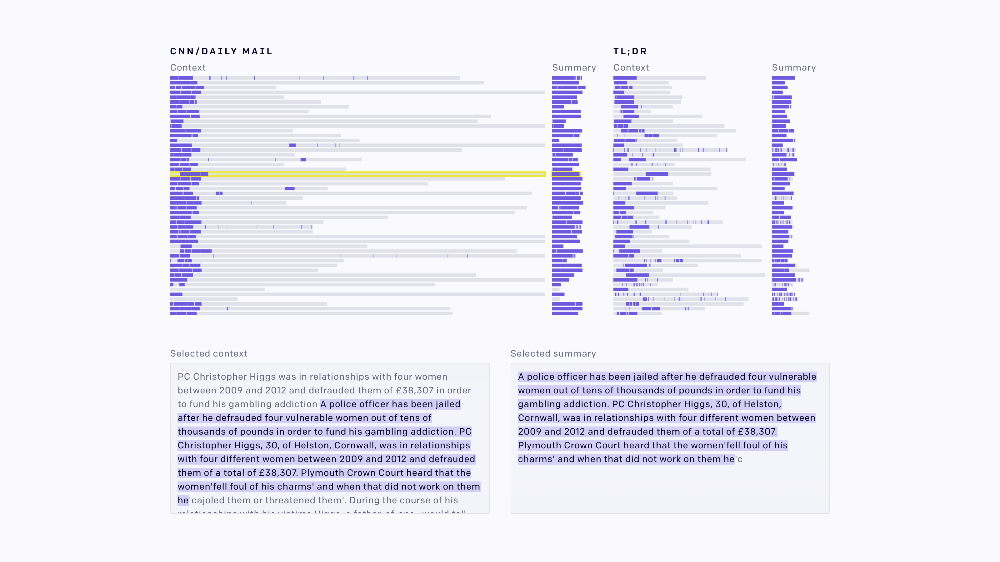

# Fine-Tuning GPT-2 from
Human Preferences

## Summary

<!--kg-card-begin: markdown-->

We’ve fine-tuned the 774M parameter GPT-2 language model using human feedback for various tasks, successfully matching the preferences of the external human labelers, though those preferences did not always match our own. Specifically, for summarization tasks the labelers preferred sentences copied wholesale from the input (we’d only asked

## Content

<!--kg-card-begin: markdown-->

We’ve fine-tuned the 774M parameter GPT-2 language model using human feedback for various tasks, successfully matching the preferences of the external human labelers, though those preferences did not always match our own. Specifically, for summarization tasks the labelers preferred sentences copied wholesale from the input (we’d only asked them to ensure accuracy), so our models learned to copy. Summarization required 60k human labels; simpler tasks which continue text in various styles required only 5k. Our motivation is to move safety techniques closer to the general task of “machines talking to humans,” which we believe is key to extracting information about human values.

<section class="btns"><a class="btn btn-padded icon-paper" href="https://arxiv.org/abs/1909.08593">Read Paper</a><a class="btn btn-padded icon-code" href="https://github.com/openai/lm-human-preferences">View Code</a></section>

We believe language is a key ingredient in making reinforcement learning practical and safe for real-world tasks. <a href="https://openai.com/blog/deep-reinforcement-learning-from-human-preferences">Previous</a> <a href="https://arxiv.org/abs/1811.06521">work</a> on learning models of human preferences has focused on simple simulated environments (Atari games or robotics tasks) which do not capture the complexity of language. Language is also a necessary ingredient for algorithms such as <a href="https://openai.com/blog/amplifying-ai-training">amplification</a> and <a href="https://openai.com/blog/debate">debate</a>, which target the reasoning behind preferences.

This work applies human preference learning to several natural language tasks: continuing text with positive sentiment or physically descriptive language using the <a href="https://github.com/soskek/bookcorpus">BookCorpus</a>, and summarizing content from the <a href="https://www.aclweb.org/anthology/W17-4508">TL;DR</a> and <a href="https://github.com/abisee/cnn-dailymail">CNN/Daily Mail</a> datasets. Each of these tasks can be viewed as a text completion problem: starting with some text <em>X</em>, we ask what text <em>Y</em> should follow.<a href="#fn1" id="fnref1">[1]</a>

We start with a pretrained language model (<a href="https://openai.com/blog/gpt-2-6-month-follow-up">the 774M parameter version of GPT-2</a>) and fine-tune the model by asking <a href="https://scale.ai">human labelers</a> which of four samples is best.  Fine-tuning for the stylistic continuation tasks is sample efficient: 5,000 human samples suffice for strong performance according to humans. For summarization, models trained with 60,000 comparisons learn to copy whole sentences from the input while skipping irrelevant preamble; this copying is an easy way to ensure accurate summaries, but may exploit the fact that labelers rely on simple heuristics.

<h2 id="stylistictextcontinuation">Stylistic text continuation</h2>

For the stylistic continuation tasks, samples comparing the raw 774M GPT-2 model and our fine-tuned versions are shown below.<a href="#fn2" id="fnref2">[2]</a>

<input checked="" class="switch-input" id="sentiment-switch" name="switch-continuation" onclick="toggle(['sentiment'], ['descriptiveness'])" type="radio" value="sentiment-switch"/>
<label class="switch-label switch-label-off small-caps" for="sentiment-switch">Sent.Sentiment</label>
<input class="switch-input" id="descriptiveness-switch" name="switch-continuation" onclick="toggle(['descriptiveness'], ['sentiment'])" type="radio" value="descriptiveness-switch"/>
<label class="switch-label switch-label-on small-caps" for="descriptiveness-switch">Desc.Descriptiveness</label>

Given some text, generate a natural continuation of the text with <strong>positive sentiment</strong>:

<!-- sample, text continuation - sentiment -->

<button class="button-unstyled color-fg-40 fade js-refresh-sample" onclick="refreshSample('sentiment')" style="visibility:hidden">
refreshView another sample
</button>

<aside class="color-fg-60 xsmall-copy ml-auto mb-0.2 position-xl-relative text-xl-right" style="top:0.2em">
  Context
</aside>

She looked tired. She'd been crying.  Next to her was a man of medium build and unremarkable height, with brown hair just tousled enough to be fashionable. He wore a grey suit, its gravity somewhat offset by a black tie that featured Marvin the Martian. I recognized him.

<!-- end .row -->

<aside class="color-fg-60 xsmall-copy ml-auto mb-0.2 position-xl-relative text-xl-right" style="top:0.2em">
  Zero-shot  baseline
</aside>

<samp data-id="sent-z">
He was the guy who'd been chasing me the day I'd arrived in the city.
</samp>

<!-- end .row -->

<aside class="color-fg-60 xsmall-copy ml-auto mb-0.2 position-xl-relative text-xl-right" style="top:0.2em">
  RL fine-tuning
</aside>

<samp class="font-bold" data-id="sent-f">
He smiled at me and I smiled back. He was pleasant enough, for a man of his age.
</samp>

<!-- end .row -->

<!-- end .container -->

<!-- end .sample -->

<!-- end #sentiment -->

Given some text, generate a natural continuation of the text with <strong>physically descriptive text</strong>:

<!-- sample, text continuation - descriptiveness -->

<button class="button-unstyled color-fg-40 fade js-refresh-sample" onclick="refreshSample('descriptiveness')" style="visibility:hidden">
refreshView another sample
</button>

<aside class="color-fg-60 xsmall-copy ml-auto mb-0.2 position-xl-relative text-xl-right" style="top:0.2em">
  Context
</aside>

Her dark brown eyes didn't even glance his way. They went straight past him, into the house.  "Where's Jeff?"  "Don't know."  That finally succeeded in getting her to look at him, but then she quickly glanced away and continued to search the house with her gaze.

<!-- end .row -->

<aside class="color-fg-60 xsmall-copy ml-auto mb-0.2 position-xl-relative text-xl-right" style="top:0.2em">
  Zero-shot  baseline
</aside>

<samp data-id="desc-z">
Grant stood there, watching her.  "Are you okay?" he asked.
</samp>

<!-- end .row -->

<aside class="color-fg-60 xsmall-copy ml-auto mb-0.2 position-xl-relative text-xl-right" style="top:0.2em">
  RL fine-tuning
</aside>

<samp class="font-bold" data-id="desc-f">
Her brows tightened, and she paced the floor before stopping before him, her lips pressed tight.
</samp>

<!-- end .row -->

<!-- end .container -->

<!-- end .sample -->

<!-- end #descriptiveness -->

According to the same human labelers used to train them, our fine-tuned models are preferred to the base GPT-2 model (zero-shot) 88% and 86% of the time for sentiment and descriptiveness, respectively.

<h2 id="summarization">Summarization</h2>

We also applied human fine-tuning to two summarization tasks: summarization of articles from the CNN/Daily Mail dataset, and summarization of Reddit snippets from the TL;DR dataset.

These tasks are harder: our main models use 60,000 four-way comparisons. We also need <em>online</em> data collection, where the samples shown to humans are collected throughout training as the policy changes; an <em>offline</em> data collection strategy which shows humans only samples from the base GPT-2 language model performed poorly.

Our models achieve very good performance according to human labelers, but are likely exploiting the fact that labelers rely on simple heuristics: they prefer the lead-3 baseline of copying the first three sentences to our models. However, when combining supervised fine-tuning with human fine-tuning, our models outperform lead-3 on ROUGE scores.

Samples from zero-shot and supervised baselines, as well as RL fine-tuning of each, are shown below.

<input checked="" class="switch-input" id="news-switch" name="switch-summarization" onclick="toggle(['news'], ['tldr'])" type="radio" value="news-switch"/>
<label class="switch-label switch-label-off small-caps" for="news-switch">CNN/DMCNN/Daily Mail</label>
<input class="switch-input" id="tldr-switch" name="switch-summarization" onclick="toggle(['tldr'], ['news'])" type="radio" value="tldr-switch"/>
<label class="switch-label switch-label-on small-caps" for="tldr-switch">TL;DR</label>

<!-- sample, summarization - news -->

<button class="button-unstyled color-fg-40 fade js-refresh-sample" onclick="refreshSample('news')" style="visibility:hidden">
refreshView another sample
</button>

<aside class="color-fg-60 xsmall-copy ml-auto mb-0.2 position-xl-relative text-xl-right" style="top:0.2em">
  Context
</aside>

Prehistoric man sketched an incredible array of prehistoric beasts on the rough limestone walls of a cave in modern day France 36,000 years ago.  Now, with the help of cutting-edge technology, those works of art in the Chauvet-Pont-d'Arc Cave have been reproduced to create the biggest replica cave in the world.  The manmade cavern named the Caverne du Pont-d'Arc has been built a few miles from the original site in Vallon-Pont-D'arc in Southern France and contains 1,000 painstakingly-reproduced drawings as well as around 450 bones and other features.  Scroll down for video  Cavemen and women sketched an incredible array of prehistoric beasts on the rough limestone walls of a cave 36,000 years ago and now a replica has been created (pictured)  The replica cave (pictured) contains 1,000 painstakingly reproduced drawings, as well as bones and other debris  It contains pictures of oxen, cows, deer and other animals the original artists used as inspiration  The original and unique ‘Grotte Chauvet’ was discovered around 20 years ago and is a Unesco World Heritage Site.  It is the oldest known and the best preserved cave decorated by man, but is not open to the public and is only seen by a handful of experts every year, in order to keep the precious works of art safe.  Now experts have scanned the original drawings using 3D modelling techniques to capture each marking and position them correctly on the bumpy replica walls to the millimetres.  The replica cave (pictured) has been built near Vallon-Pont-D'arc in Southern France and contains 1,000 painstakingly-reproduced drawings of 425 animals as well as around 450 bones  It is the oldest cave decorated by man – and the best preserved, but is not open to the public to keep the precious works of art safe. It bears images of woolly rhinos for example (the replica drawings are shown)  ‘The most remarkable paintings, engravings, palaeontological and essential geological representations are reproduced full-scale from the scanned originals,’ promotional material says.  ‘The objective is to reproduce the emotions originally aroused by the cave and to reveal its hidden world.’  The drawings include images of 14 different species such as cave bears, woolly rhinoceros, mammoths and big cats, some of which are the only representations in Palaeolithic cave art.  Unique representations include a panther, owl and even part of the female body, making the original site an invaluable research subject for scientists around the world.  Experts scanned the original drawings using 3D modelling techniques to capture each marking and position them correctly on the bumpy replica walls to the millimetre. A replica mammoth is shown  The drawings include images of 14 different species such as cave bears, woolly rhinoceros, mammoths and big cats, some of which are the only representations in Palaeolithic cave art. The reproduction is shown  'The Decorated Cave of Pont-d’Arc is an invitation to a journey back in time, a wonderful dive into the heart of humanity and a major landmark in the history of civilisation,' said the creators of the replica  Creators added that one of their objectives was to reproduce the emotions aroused by the original cave  A solitary sketch of an antelope lies on a wall of the massive replica cave in southern France  The replica cave called the Caverne du Pont-d'Arc has been built a few miles from the original site in Vallon-Pont-D'arc in Southern France (shown with a red marker)  Unique representations include a panther, owl and even part of the female body, making the original site an invaluable research subject for scientists around the world. The panther is among these big cats  While the real cave is 91,490 square feet (8,500 metres) the replica is 32,290 square feet (3,000 square metres) in area. Here, copies of drawings can be seen on the ceiling  Visitors to the Caverne du Pont-d'Arc marvel at the replica cave, which is almost identical to the 36,000 year old Vallon-Pont-D'arc  The replica cave (pictured) will open to the public on April 25. Pictured is a drawing of a horse that adorns its roof  The replica cave reproduces the complex and turbulent works of art depicted in the Decorated Cave of Pont-d’Arc.  Specialists used 3D modelling and anamorphic techniques, the latter of which is used to shoot widescreen images.  Using a high-precision scanner, a three-dimensional digital model of the cave was created.  Experts first modelled the cave’s continuous surface and then made it fit the new space accordingly.  They took 6,000 digital photos of the artwork, allowing it to be copied accurately.  Images were placed on the corresponding computerised cave-walls before being transferred onto the physical replica.  The new cave also includes replica paw prints of  bears, bones and details preserved in the original cave.  But while the real cave is 91,490 square feet (8,500 metres) the replica is 32,290 square feet (3,000 square metres) in area and visitors to the attraction, which opens on April 25, will be able to take in the artwork while standing on a raised walkway.  Promotional material for the replica says: ‘Today, the bold alliance of artistic creation and the most advanced technologies, some of which were used for the first time, make of this replica a true prototype.  ‘…The Decorated Cave of Pont-d’Arc is an invitation to a journey back in time, a wonderful dive into the heart of humanity and a major landmark in the history of civilisation.  ‘Our ambition is to give visitors the opportunity to feel the same emotions, experience the same sensations and the surprise to discover a unique place in the world.’  Hervé Saulignac, President of the General Council of the Ardèche and Vice-President of the Rhône-Alpes Region, said: ‘36 000 years separate us from these men, highflying artists, who settled there, a few metres from a river that still defines our territory.  'Almost everything is similar – nature - it has not aged.  ‘Our ambition is that it should be the same. To preserve this masterpiece for future generations, to continue to make it indestructible, untouched by the ravages of man and time…’  The attraction, which has cost €55 million (£340 million or $60 million), also includes a discovery centre, which will inform visitors about the flora, fauna and daily lives of our ancestors who lived in the region 36,000 years ago.  Sketches of panthers adorn the wall of the replica cave, which cost £340million to create  It is the largest replica cave in the world and features a walkway from which visitors can view the reproduced sketches  Promotional material for the replica says: ‘Today, the bold alliance of artistic creation and the most advanced technologies, some of which were used for the first time, make of this replica a true prototype.' A reproduction of a sketch of a woolly rhino done 36,000 years ago, is shown  The replica cavern condenses 8,000 square metres of the original site into 3,000 square metres and contains more than 1,000 drawings  A visitor to the cave points at the animal drawings which were modelled identically on those discovered in southern France 20 years ago  Creators hope the replica will help preserve the masterpiece of original cave art discovered 20 years ago - which is only open to researchers  The attraction also includes a discovery centre, which will inform visitors about the flora, fauna and daily lives of our ancestors who lived in the region  The site is not just limited to artwork - pictured here are replicas of more than 450 bones found in the original Vallon-Pont-D'arc  Sketches adorning the replica cave's walls include images of antelopes, panthers, horses and cows

<!-- end .row -->

<button class="js-toggler active btn py-0.25 mr-0.5" onclick="toggle(['news-z', 'news-f'], ['news-s','news-sf'])">Zero-shot</button>
<button class="js-toggler btn py-0.25" onclick="toggle(['news-s','news-sf'], ['news-z', 'news-f'])">Supervised</button>

<aside class="color-fg-60 xsmall-copy ml-auto mb-0.2 position-xl-relative text-xl-right" style="top:0.2em">
  Zero-shot  baseline
</aside>

<samp data-id="news-z">
The caves are a bit more than a little creepy and you might want to avoid going in for a closer look. THE ORIGINAL AND ULTIMATE 'Grotte Chauvet' The original and unique 'Grotte Chauvet' was discovered around 20 years ago and is a Unesco World Heritage Site. It is the oldest known and the best preserved cave decorated by man, but is not open to the public and is only seen by a handful of experts every year,
</samp>

<!-- end .row -->

<aside class="color-fg-60 xsmall-copy ml-auto mb-0.2 position-xl-relative text-xl-right" style="top:0.2em">
  RL fine-tuning
</aside>

<samp data-id="news-f">
Prehistoric man sketched an incredible array of prehistoric beasts on the rough limestone walls of a cave in modern day France 36,000 years ago. Now, with the help of cutting-edge technology, those works of art in the Chauvet-Pont-d'Arc Cave have been reproduced to create the biggest replica cave in the world 'The most remarkable paintings, engravings, palaeontological and essential geological representations are reproduced full-scale from the scanned originals,' promotional material says.
</samp>

<!-- end .row -->

<aside class="color-fg-60 xsmall-copy ml-auto mb-0.2 position-xl-relative text-xl-right" style="top:0.2em">
  Supervised  baseline
</aside>

<samp data-id="news-s">
The Chauvet-Pont-d'Arc Cave in southern France contains 1,000 painstakingly-reproduced drawings as well as 450 bones and other features. The original and unique 'Grotte Chauvet' was discovered around 20 years ago and is a Unesco World Heritage Site. The replica cave contains 1,000 painstakingly-reproduced drawings of 425 animals as well as around 450 bones and other features.
</samp>

<!-- end .row -->

<aside class="color-fg-60 xsmall-copy ml-auto mb-0.2 position-xl-relative text-xl-right" style="top:0.2em">
  Supervised +  RL fine-tuning
</aside>

<samp data-id="news-sf">
Chauvet-Pont-d'Arc Cave in Southern France has been built with 1,000 painstakingly-reproduced drawings as well as around 450 bones and other features. It contains pictures of oxen, cows, deer and other animals the original artists used as inspiration.
</samp>

<!-- end .row -->

<!-- end .container -->

<!-- end .sample -->

<!-- end #news -->

<!-- sample, summarization - tl;dr -->

<button class="button-unstyled color-fg-40 fade js-refresh-sample" onclick="refreshSample('tldr')" style="visibility:hidden">
refreshView another sample
</button>

<aside class="color-fg-60 xsmall-copy ml-auto mb-0.2 position-xl-relative text-xl-right" style="top:0.2em">
  Context
</aside>

Okay, this was actually going to go into a comment on youtube, but Emma said she wanted more traffic on reddit.  I am a musician myself, have been for many years now. While Emma's music is not the most complicated technical death metal stuff out there, I love it dearly. Her music actually moves me. No matter what she plays, be it a cover or original stuff, her music *touches* me on a deep personal level. And I have absolutely no clue why. I think it's a combination of her voice, her lyrics and the overall sound design of her songs and covers.  But this isn't always a good thing, I feel. I can't listen to her music for hours on end. Only always a few songs, nothing more. Her music destroys me emotionally. Okay, that's a bit harsh, but she can get me, a (nearly) adult on the verge of tears. I've gone through some shit in my life, who hasn't, and I feel like her music can actually get some of it out. I am incredibly thankful that she makes her music the way she makes it. I can honestly say that Emma Blackery is my favourite artist. Keep in mind that I listen to a lot of music, from crossover thrash metal over 80's pop, berlin polygenre to classic/romantic music.  I am also very jealous of her ability. I play quite a few instruments myself (guitar, piano, bass, drums, synth, saxophone, percussion) and aim to study audio engineering. I can definitely say that music is my literal life and mean it. I've released my first full length album at age 20. Yet I am very jealous that she is as good as she is and I really wanna know what her secret is. I love and hate her music, does that make sense?  Her music definitely makes me think, and that's what art is all about, right? Anyway, I'm gonna continue working on my cover of The Promise and try to figure out what it is she's doing. Thank you for reading this far.

<!-- end .row -->

<button class="js-toggler active btn py-0.25 mr-0.5" onclick="toggle(['tldr-z', 'tldr-f'], ['tldr-s','tldr-sf'])">Zero-shot</button>
<button class="js-toggler btn py-0.25" onclick="toggle(['tldr-s','tldr-sf'], ['tldr-z', 'tldr-f'])">Supervised</button>

<aside class="color-fg-60 xsmall-copy ml-auto mb-0.2 position-xl-relative text-xl-right" style="top:0.2em">
  Zero-shot  baseline
</aside>

<samp data-id="tldr-z">
I'm a musician myself, have been for many years now. And Emma Blackery is my favourite artist.
</samp>

<!-- end .row -->

<aside class="color-fg-60 xsmall-copy ml-auto mb-0.2 position-xl-relative text-xl-right" style="top:0.2em">
  RL fine-tuning
</aside>

<samp data-id="tldr-f">
I am a musician myself, have been for many years now. While Emma's music is not the most technical death metal stuff out there, I love it dearly. Her music actually moves me. No matter what she plays, be it a cover or original stuff, her music *touches* me on a deep personal level.
</samp>

<!-- end .row -->

<aside class="color-fg-60 xsmall-copy ml-auto mb-0.2 position-xl-relative text-xl-right" style="top:0.2em">
  Supervised  baseline
</aside>

<samp data-id="tldr-s">
I'm jealous of Emma Blackery's music and I have no clue why.
</samp>

<!-- end .row -->

<aside class="color-fg-60 xsmall-copy ml-auto mb-0.2 position-xl-relative text-xl-right" style="top:0.2em">
  Supervised +  RL fine-tuning
</aside>

<samp data-id="tldr-sf">
Emma Blackery is my favourite artist, and I love her music to death. I wish I could listen to her music all the time. However, I feel like her music destroys me emotionally. I feel like I need to enjoy her music for the human part of it, and not the technical part. She's my favourite artist.
</samp>

<!-- end .row -->

<!-- end .container -->

<!-- end .sample -->

<!-- end #tldr -->

The reader may have noticed a few things about these samples. First, our RL fine-tuned model is mostly a smart copying engine: it typically summarizes content by copying entire sentences from the article or Reddit snippet. By contrast, the zero-shot and supervised fine-tuned samples are more novel:

<h4 class="mt-1.5 mb-0.125">Sentence novelty</h4>

Percentage of sentences in summaries that do not appear in source text.

<table class="d-block d-md-table w-100 mt-0.75 bar-table">
<thead>
<th>Model</th>
<th style="min-width:13.5em">CNN/Daily Mail</th>
<th style="min-width:13.5em">TL;DR</th>
</thead>
<tr>
<td>Reference summaries</td>
<td>

96.7
<svg class="w-100" preserveaspectratio="none" viewbox="0 0 100 1" xmlns="http://www.w3.org/2000/svg"><defs></defs><title>nov-news-ref</title><rect class="cls-1" height="1" width="96.73"></rect></svg>

</td>
<td>

98.9
<svg class="w-100" preserveaspectratio="none" viewbox="0 0 100 1" xmlns="http://www.w3.org/2000/svg"><defs></defs><title>nov-tldr-ref</title><rect class="cls-1" height="1" width="98.93"></rect></svg>

</td>
</tr>
<tr>
<td>Zero-shot</td>
<td>

91.7
<svg class="w-100" preserveaspectratio="none" viewbox="0 0 100 1" xmlns="http://www.w3.org/2000/svg"><defs></defs><title>nov-news-zero-shot</title><rect class="cls-1" height="1" width="91.69"></rect></svg>

</td>
<td>

96.3
<svg class="w-100" preserveaspectratio="none" viewbox="0 0 100 1" xmlns="http://www.w3.org/2000/svg"><defs></defs><title>nov-tldr-zero-shot</title><rect class="cls-1" height="1" width="96.33"></rect></svg>

</td>
</tr>
<tr>
<td>Fine-tuned</td>
<td>

2.5
<svg class="w-100" preserveaspectratio="none" viewbox="0 0 100 1" xmlns="http://www.w3.org/2000/svg"><defs></defs><title>nov-news-fine-tuned</title><rect class="cls-1" height="1" width="2.49"></rect></svg>

</td>
<td>

29.0
<svg class="w-100" preserveaspectratio="none" viewbox="0 0 100 1" xmlns="http://www.w3.org/2000/svg"><defs></defs><title>nov-tldr-fine-tuned</title><rect class="cls-1" height="1" width="29.01"></rect></svg>

</td>
</tr>
<tr>
<td>Supervised</td>
<td>

83.6
<svg class="w-100" preserveaspectratio="none" viewbox="0 0 100 1" xmlns="http://www.w3.org/2000/svg"><defs></defs><title>nov-news-supervised</title><rect class="cls-1" height="1" width="83.63"></rect></svg>

</td>
<td>

96.9
<svg class="w-100" preserveaspectratio="none" viewbox="0 0 100 1" xmlns="http://www.w3.org/2000/svg"><defs></defs><title>nov-tldr-supervised</title><rect class="cls-1" height="1" width="96.9"></rect></svg>

</td>
</tr>
<tr>
<td>Supervised + Fine-tuned</td>
<td>

69.6
<svg class="w-100" preserveaspectratio="none" viewbox="0 0 100 1" xmlns="http://www.w3.org/2000/svg"><defs></defs><title>nov-news-supervised-fine-tuned</title><rect class="cls-1" height="1" width="69.55"></rect></svg>

</td>
<td>

94.0
<svg class="w-100" preserveaspectratio="none" viewbox="0 0 100 1" xmlns="http://www.w3.org/2000/svg"><defs></defs><title>nov-tldr-supervised-fine-tuned</title><rect class="cls-1" height="1" width="93.97"></rect></svg>

</td>
</tr>
</table>

The RL fine-tuned model does vary where it copies from: while they copy the start of the input 28.3% and 77.6% of the time on TL;DR and CNN/Daily Mail, these numbers fall to 0.2% and 1.4% if the input starts with uninformative preamble (defined as “hi”, “hello”, “hey”, “ok”, “okay”, “so” for TL;DR, or a colon in the first three words for CNN/Daily Mail such as “Winner: Simon Wood took home the TV crown [...]”).

<h4 class="mt-1.5 mb-0.125">Where the summarization models copy from</h4>

Variation in where the models copy from, illustrated by the longest common subsequence of bigrams between context and summary for randomly chosen contexts.

Second, while summaries from GPT-2 zero-shot and the supervised fine-tuned version of GPT-2 are more novel as measured by n-grams or sentences, they are also more novel in terms of content. That is, they're not true:

<h4 class="mt-1.5 mb-0.125">Summary accuracy</h4>

Accuracy frequency of generated summaries, judged by authors on 30 articles from each dataset.

<table class="d-block d-md-table w-100 mt-0.75 bar-table">
<thead>
<th>Model</th>
<th style="min-width:13.5em">CNN/Daily Mail</th>
<th style="min-width:13.5em">TL;DR</th>
</thead>
<tr>
<td>Zero-shot</td>
<td>

6/30
<svg class="w-100" preserveaspectratio="none" viewbox="0 0 100 1" xmlns="http://www.w3.org/2000/svg"><defs></defs><title>acc-news-zero-shot</title><rect class="cls-1" height="1" width="20"></rect></svg>

</td>
<td>

6/30
<svg class="w-100" preserveaspectratio="none" viewbox="0 0 100 1" xmlns="http://www.w3.org/2000/svg"><defs></defs><title>acc-tldr-zero-shot</title><rect class="cls-1" height="1" width="20"></rect></svg>
</td>
</tr>
<tr>
<td>Fine-tuned</td>
<td>

29/30
<svg class="w-100" preserveaspectratio="none" viewbox="0 0 100 1" xmlns="http://www.w3.org/2000/svg"><defs></defs><title>acc-news-fine-tuned</title><rect class="cls-1" height="1" width="96.67"></rect></svg>
</td>
<td>

26/30
<svg class="w-100" preserveaspectratio="none" viewbox="0 0 100 1" xmlns="http://www.w3.org/2000/svg"><defs></defs><title>acc-tldr-fine-tuned</title><rect class="cls-1" height="1" width="86.67"></rect></svg>
</td>
</tr>
<tr>
<td>Supervised</td>
<td>

19/30
<svg class="w-100" preserveaspectratio="none" viewbox="0 0 100 1" xmlns="http://www.w3.org/2000/svg"><defs></defs><title>acc-news-supervised</title><rect class="cls-1" height="1" width="63.33"></rect></svg>
</td>
<td>

8/30
<svg class="w-100" preserveaspectratio="none" viewbox="0 0 100 1" xmlns="http://www.w3.org/2000/svg"><defs></defs><title>acc-tldr-supervised</title><rect class="cls-1" height="1" width="26.67"></rect></svg>
</td>
</tr>
<tr>
<td>Supervised + Fine-tuned</td>
<td>

20/30
<svg class="w-100" preserveaspectratio="none" viewbox="0 0 100 1" xmlns="http://www.w3.org/2000/svg"><defs></defs><title>acc-news-supervised-fine-tuned</title><rect class="cls-1" height="1" width="66.67"></rect></svg>
</td>
<td>

11/30
<svg class="w-100" preserveaspectratio="none" viewbox="0 0 100 1" xmlns="http://www.w3.org/2000/svg"><defs></defs><title>acc-tldr-supervised-fine-tuned</title><rect class="cls-1" height="1" width="36.67"></rect></svg>
</td>
</tr>
</table>

There are at least two ways of interpreting these results. The first is that copying is the easiest way to be accurate. The labelers were told to penalize inaccuracy but not copying. The zero-shot model copies some of the time, and when it copied it was accurate, so copying was reinforced. The result is a model that mostly copies, but at least does not lie.

However, this does not fully explain the results of human evaluation: both our model and a simple lead-3 baseline which copies the first three sentences are strongly preferred by the labelers to the human reference summaries in both datasets. The authors do not agree: we find the reference summaries are accurate and better capture the overall message. This reveals a mismatch between the notion of quality we wanted our model to learn, and what the humans labelers actually evaluated. Labelers want to work as quickly as possible, and they can work very quickly by following the heuristic of "if the summary copies, then select it."

<h2 id="challengesandlessonslearned">Challenges and lessons learned</h2>
<h4 id="onlinedatacollectionishard">Online data collection is hard</h4>

Online data collection was necessary to achieve the best results on summarization, but led to multiple difficulties:

<ol>
<li><strong>Software complexity</strong>. Interleaving data gathering, reward model training, and RL fine-tuning led to a far more complex system than if each component was separate.</li>
<li><strong>Machine learning complexity</strong>. An ML bug in any component would break the whole system, and it was awkward to debug one component in isolation.</li>
<li><strong>Quality control issues</strong>. Online label collection required low latency between generating a sample and receiving data back from <a href="https://scale.ai">Scale</a> (typically ~30 minutes). Quality control with low latency is hard, and regressions in data quality were often not detected until after training runs were complete.</li>
</ol>

We believe the right middle ground between offline and online data collection is <em>batched</em> data collection: we would alternate between collecting large batches of data (with higher latency) and training on collected data. The cost of human data means that volume will always be low, so it is easy to retrain from scratch (or rather, from the GPT-2 starting point) each time.

<h4 id="ambiguoustasksmakelabelinghard">Ambiguous tasks make labeling hard</h4>

A single human may have a clear notion of whether a given sample is separately accurate, grammatical, nonredundant, or hits the key points, but comparing two summaries often requires subjective weighing of different kinds of deficiencies. When possible, it seems better to design less ambiguous labeling tasks that get at the same information. For example, rather than asking a person to compare summaries, we could ask for a verbal description of the problems with a summary, or a suggested correction. Even if two people disagree on the most important problem, they may agree that the other picked <em>some</em> problem, and more agreement eases data quality control and the overall experimental process.

<h4 id="bugscanoptimizeforbadbehavior">Bugs can optimize for bad behavior</h4>
<aside class="aside mt-1 mt-md-0 d-none d-md-block">

An Andon cord.

</aside>

One of our code refactors introduced a bug which flipped the sign of the reward. Flipping the reward would usually produce incoherent text, but the same bug also flipped the sign of the KL penalty. The result was a model which optimized for negative sentiment while preserving natural language. Since our instructions told humans to give very low ratings to continuations with sexually explicit text, the model quickly learned to output only content of this form. This bug was remarkable since the result was not gibberish but maximally bad output. The authors were asleep during the training process, so the problem was noticed only once training had finished. A mechanism such as Toyota's <a href="https://en.wikipedia.org/wiki/Andon_(manufacturing)">Andon cord</a> could have prevented this, by allowing any labeler to stop a problematic training process.

<h2 id="lookingforward">Looking forward</h2>

We’ve demonstrated reward learning from human preferences on two kinds of natural language tasks, stylistic continuation and summarization. Our results are mixed: for continuation we achieve good results with very few samples, but our summarization models are only “smart copiers”: they copy from the input text but skip over irrelevant preamble. The advantage of smart copying is truthfulness: the zero-shot and supervised models produce natural, plausible-looking summaries that are often lies. We believe the limiting factor in our experiments is data quality exacerbated by the online data collection setting, and plan to use batched data collection in the future.

We believe the application of reward learning to language is important both from a capability and safety perspective. On the capability side, reinforcement learning lets us correct mistakes that supervised learning would not catch, but RL with programmatic reward functions “<a href="https://arxiv.org/abs/1705.04304">can be detrimental to model quality</a>.” On the safety side, reward learning for language allows important criteria like “don’t lie” to be represented during training, and is a step towards scalable safety methods such as a <a href="https://openai.com/blog/debate">debate</a> and <a href="https://openai.com/blog/amplifying-ai-training">amplification</a>.

<footer class="post-footer js-post-footer">
<!-- footer item -->

Acknowledgments

Thanks to Ethan Perez, Jack Clark, Ashley Pilipiszyn &amp; Greg Brockman for feedback on this post. Thanks to Justin Jay Wang, Brooke Chan &amp; Shan Carter for design and development.

<!-- special footer item for footnotes -->

Footnotes

<section class="footnotes">
<ol class="footnotes-list">
<li class="footnote-item" id="fn1">
For summarization, the text is the article plus the string “TL;DR:”. <a class="footnote-backref" href="#fnref1">↩︎</a>

</li>
<li class="footnote-item" id="fn2">
Each fine-tuned model is trained using 5,000 four-way comparisons by humans. <a class="footnote-backref" href="#fnref2">↩︎</a>

</li>
</ol>
</section>
<!--kg-card-end: markdown-->

</footer>