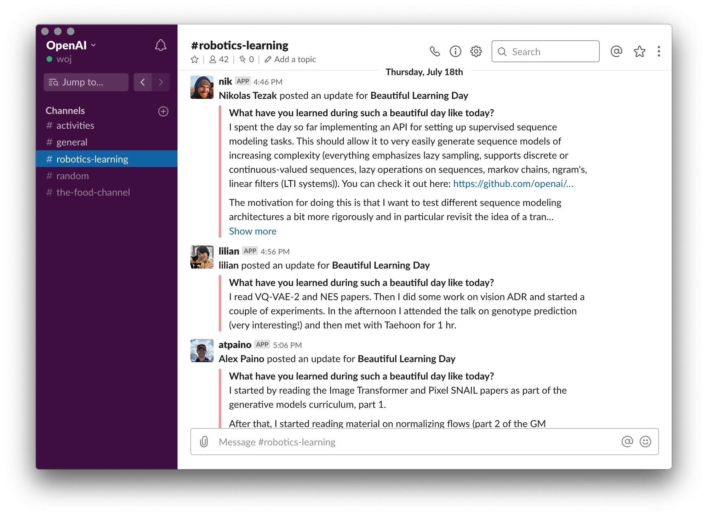

# Learning Day
###### Summary
<!--kg-card-begin: markdown-->

At OpenAI, each Thursday is Learning Day: a day where employees have the option to self-study technical skills that will make them better at their job but which aren’t being learned from daily work. We’ve found that the biggest contributions at OpenAI come from cross-functional experts, so we

<!--kg-card-begin: markdown-->

At OpenAI, each Thursday is Learning Day: a day where employees have the option to self-study technical skills that will make them better at their job but which aren’t being learned from daily work. We’ve found that the biggest contributions at OpenAI come from cross-functional experts, so we either need to hire them or grow them here. Before Learning Day, we very rarely saw people grow cross-functionally—for example, employees coming from a software background rarely picked up machine learning (something equally rare in other organizations except academia). Since Learning Day, this kind of growth has become very common.

On a typical learning day, people do things like:

<ul>
<li>Reimplement papers.</li>
<li>Follow deep learning tutorials.</li>
<li>Play with new tools in cluster management, compilation, virtual world generation, or coding paradigms.</li>
<li>Learn how to do research on bite-sized problems.</li>
<li>Read about new developments in seemingly unrelated areas of AI.</li>
</ul>

We think Learning Day might be useful for other organizations, so we’d like to share how it started and works at OpenAI.

<h3 id="backstory">Backstory</h3>

We first tried out Learning Day on our Robotics team. Here’s how our Head of Robotics, Wojciech Zaremba (Woj), came up with the idea:

<aside class="aside">
<figure class="ml-xl-auto" style="max-width: 6rem">

<figcaption>Woj, Head of Robotics</figcaption>
</figure>
</aside>

In November 2018, I realized that I’d been stagnating in a number of areas because I was always overwhelmed with urgent tasks. These areas were becoming increasingly important for me to know. For example, I kept wanting to evaluate whether my team should switch deep learning frameworks, but I kept being interrupted after an hour or two of coding—which resulted in no forward progress. I kept hearing about research in other domains like causality or energy-based models which might be applicable to robotics, but I didn’t know anything about these fields—and reading about them for half an hour at a time wasn’t helpful.

I knew the best way to solve this problem would be to carve out a day a week for learning. But if this was what I needed to be more productive, it seemed likely that this would also be what my team needed. So I tried doing this for the whole team as an experiment.

I figured that we’d take a short-term productivity hit but see gains in one to two years. But within a month, I started to see better communication between researchers and engineers, with everyone starting to use jargon from each others’ specialty correctly (e.g. discounted reward, MAML, self-attention, container, SRAM, StatefulSet, Raft). Within half a year, I started to see researchers talking about restructuring our codebase using <a href="https://en.wikipedia.org/wiki/Domain-driven_design">domain-driven design</a>, and engineers picking up research tasks.

Though we encouraged self-study before, it never seemed to work. That’s different now—for example, one team member went from knowing nothing about machine learning to making computer vision contributions within three months. One very strong engineer studied RL for half a year, and now is producing outputs comparable to what I'd expect from an RL PhD.

<h3 id="howitworks">How it works</h3>

Learning Day happens each Thursday. Woj wrote the following guidelines for the Robotics team, but we’ve adapted these principles across each team that has adopted Learning Day:

<strong>Learning day is a gift ❤️</strong>

Feel free to use learning day for:

<ul class="list-indented">
<li>Reading AI papers</li>
<li>Reimplementing AI papers</li>
<li>Going over AI tutorials</li>
<li>Having your tiny side research AI projects</li>
<li>Learning about fundamentals: linear algebra, statistics etc.</li>
<li>Learning about ML fundamentals: information theory, Bayesian inference etc.</li>
<li>Learning about engineering. Read about new programming languages, frameworks (e.g. what is Rust?)</li>
<li>Learning about management: self-management, prioritization, how renowned research labs works (e.g. Manhattan project, Bell labs)</li>
<li>Learning about mechanical engineering or having your mechanical engineering research project (e.g. build a linear actuator)</li>
<li>Learning about any skill that will level you up in your work (in my case, it's better writing)</li>
</ul>

This learning day is a gift from Woj. Therefore, I kindly ask you to:

<ul class="list-indented mb-0">
<li>Take advantage of this day, and really use it for learning. Don't waste it on Netflix, or don't use it as an extra weekend day.</li>
<li>Please write what you are planning to learn, and please write summaries. This will help to motivate others to keep on pushing.</li>
<li>Please don't be shy in sharing what you are learning. It's fine if you don't know fundamentals, and it's fine to say that you learned what is matrix multiplication. Everyone of us was there at some point. I would like to help you to level up.</li>
<li>Please make sure that activities from the learning day don't leak out to other non-learning days. For instance, it would suck if you would devote the entire week on learning fundamentals, or working on your side project.</li>
</ul>

To keep people accountable, we ask everyone to post in Slack what they learned that day.

<h3 id="whatwelearnonlearningday">What we learn on Learning Day</h3>

The following are examples of what people learn on a single Learning Day.

<h4 id="deeplearningreading">Deep learning reading</h4>
<ul>
<li>"<a href="https://arxiv.org/abs/1905.05393">Population Based Augmentation: Efficient Learning of Augmentation Policy Schedules</a>"</li>
<li>"<a href="https://arxiv.org/abs/1906.00410">Learning Domain Randomization Distributions for Transfer of Locomotion Policies</a>"</li>
<li>"<a href="https://bair.berkeley.edu/blog/2019/06/10/pearl/">Neural Graph Evolution: Towards Efficient Automatic Robot Design 
Learning to Learn with Probabilistic Task Embeddings</a>"</li>
<li>"<a href="http://perceptual.actor/assets/main_paper.pdf">Mid-Level Visual Representations Improve Generalization and Sample Efficiency for Learning Visuomotor Policies</a>"</li>
<li>"<a href="https://arxiv.org/abs/1903.08254">Efficient Off-Policy Meta-Reinforcement Learning via Probabilistic Context Variables</a>"</li>
<li>"<a href="https://arxiv.org/pdf/1905.12887.pdf">Does computer vision matter for action?</a>"</li>
<li>"<a href="https://arxiv.org/abs/1810.01392">WAIC, but Why? Generative Ensembles for Robust Anomaly Detection</a>"</li>
<li>"<a href="https://arxiv.org/abs/1906.04358">Weight Agnostic Neural Networks</a>"</li>
<li>"<a href="https://arxiv.org/abs/1811.12359">Challenging Common Assumptions in the Unsupervised Learning of Disentangled Representations</a>"</li>
<li><a href="https://sites.google.com/view/berkeley-cs294-158-sp19/home">Deep unsupervised learning</a></li>
<li><a href="https://sites.google.com/view/deep-rl-bootcamp/lectures">Deep RL Bootcamp</a></li>
</ul>
<h4 id="deeplearningcoding">Deep learning coding</h4>
<ul>
<li><a href="https://openai.com/blog/reptile/">Reptile</a> and <a href="https://arxiv.org/abs/1803.02999">MAML</a></li>
<li>Play with code in <a href="https://github.com/google/jax">JAX</a></li>
<li>Apply <a href="https://github.com/openai/sparse_attention">Sparse Transformers</a> to vision tasks</li>
<li>Implement LSTM and transformer from scratch; train them on Penn treebank</li>
<li>Train a neural net to reproduce the behavior of a physical motor</li>
</ul>
<h4 id="mathandstatistics">Math and statistics</h4>
<ul>
<li><a href="https://www.youtube.com/watch?v=uBeM1FUk4Ps&amp;t=1606s">Time Series Analysis</a></li>
<li><a href="https://www.amazon.com/Book-Why-Science-Cause-Effect/dp/046509760X"><em>The Book of Why: The New Science of Cause and Effect</em></a></li>
</ul>
<h4 id="management">Management</h4>
<ul>
<li><a href="https://www.amazon.com/Thanks-Feedback-Science-Receiving-Well/dp/0670014664"><em>Thanks for the Feedback: The Science and Art of Receiving Feedback Well</em> </a></li>
<li><a href="https://www.amazon.com/Change-Your-Questions-Life-Institute/dp/1576756009"><em>Change Your Questions, Change Your Life: 10 Powerful Tools for Life and Work</em></a></li>
</ul>
<h4 id="historicalcontextonpowerfultechnologies">Historical context on powerful technologies</h4>
<ul>
<li><a href="https://www.amazon.com/Dark-Territory-Secret-History-Cyber/dp/1476763267"><em>Dark Territory: The Secret History of Cyber War</em></a></li>
<li><a href="https://www.amazon.com/Hacked-World-Order-Maneuver-Manipulate/dp/1469065894"><em>The Hacked World Order: How Nations Fight, Trade, Maneuver, and Manipulate in the Digital Age</em></a></li>
<li><a href="https://www.amazon.com/Technology-Transfer-USSR-1928-1937-1966-1975-ebook/dp/B07TKDR9Q2"><em>Technology Transfer to the USSR, 1928–1937 and 1966–1975: The Role of Western Technology in Soviet Economic Development</em></a></li>
<li><a href="https://www.amazon.com/Turing-Test-Behavior-Hallmark-Intelligence/dp/0262692937"><em>The Turing Test: Verbal Behavior as the Hallmark of Intelligence</em></a></li>
<li><a href="https://www.amazon.com/Information-History-Theory-Flood/dp/1400096235"><em>The Information: A History, A Theory, A Flood</em></a></li>
<li><a href="http://radicalmarkets.com/"><em>Radical Markets: Uprooting Capitalism and Democracy for a Just Society</em></a></li>
</ul>

We also reimburse reasonable self-studying expenses such as books and tutors, used mostly to learn fundamentals in mathematics. These costs are very worthwhile investments!

<h3 id="howwesustainit">How we sustain it</h3>

Learning Day’s impact comes from being rigorous about how people use it. It’s not a day for leisure, but instead a day for a specific kind of hard work. We see and try to counteract the following failure modes so that we can sustain it long term:

<strong>Learning Day could be used for work</strong>. Learning Day could turn into a normal working day because people may want to accomplish their main project faster (due to internal or external pressure). We prevent this by having Learning Day on the same day for every team. This creates positive peer pressure and encourages everyone to take advantage of Learning Day.

<strong>Learning Day could expand in scope to non–Learning Days</strong>. We actually haven’t yet observed this happen. Based on what we’ve seen with other organizations, we think this would most likely indicate that the person isn’t excited enough about their main project, and would be a sign to their manager that the person should switch teams or projects.

<strong>Learning Day could be used for leisure</strong>. Our solution is for every team member to share their progress on Slack via <a href="https://geekbot.com/">Geekbot</a>. This keeps the excitement high and provides an accountability mechanism.

<h3 id="learningdaybeyondrobotics">Learning Day beyond Robotics</h3>

We’ve recently expanded Learning Day from a subset of our technical teams to the entire company. It’s become a cultural staple—on our most recent internal survey, Learning Day was the aspect of our culture that people talked about the most. We’re excited to see its impact as we continue to evolve and support Learning Day in the future.

<!--kg-card-end: markdown-->