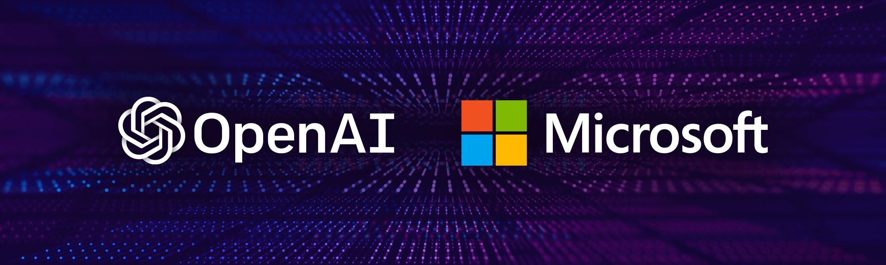
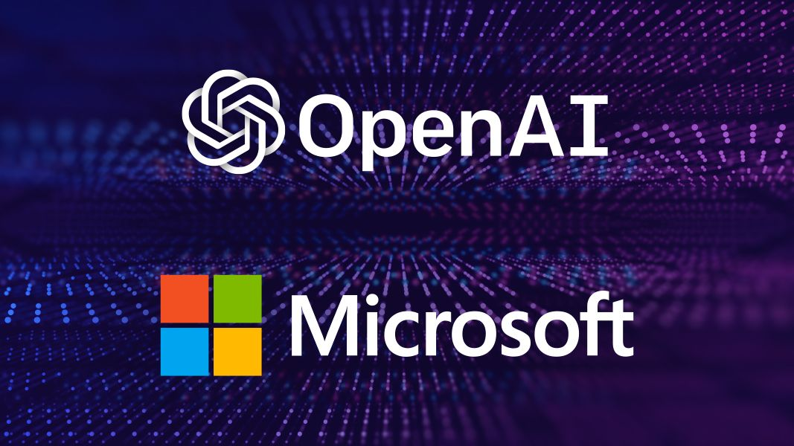
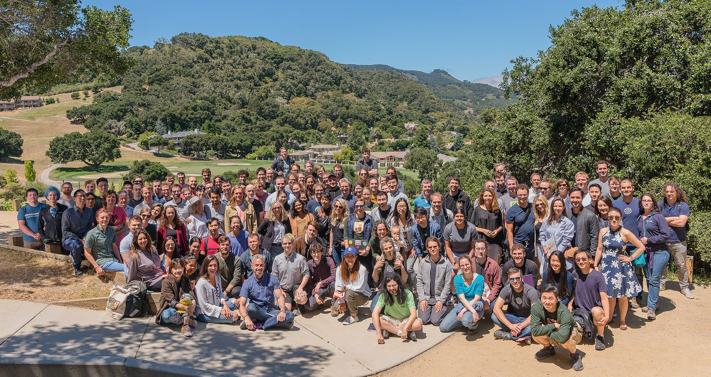

# Microsoft Invests In and Partners with OpenAI to Support Us Building Beneficial AGI

## Summary

<!--kg-card-begin: markdown-->

Microsoft is investing $1 billion in OpenAI to support us building artificial general intelligence (AGI) with <a href="https://openai.com/charter/">widely distributed</a> economic benefits. We're partnering to develop a hardware and software platform within Microsoft Azure which will scale to AGI. We’ll jointly develop new Azure AI supercomputing technologies, and Microsoft will become

## Content

<!--kg-card-begin: markdown-->

Microsoft is investing $1 billion in OpenAI to support us building artificial general intelligence (AGI) with <a href="https://openai.com/charter/">widely distributed</a> economic benefits. We're partnering to develop a hardware and software platform within Microsoft Azure which will scale to AGI. We’ll jointly develop new Azure AI supercomputing technologies, and Microsoft will become our exclusive cloud provider—so we'll be working hard together to further extend Microsoft Azure's capabilities in large-scale AI systems.

<figure class="mt-0.5 mb-1.5">

<figcaption>OpenAI team and their families at our July 2019 offsite.</figcaption>
</figure>

Each year since 2012, the world has seen a new step function advance in AI capabilities. Though these advances are across very different fields like <a href="https://medium.com/coinmonks/paper-review-of-alexnet-caffenet-winner-in-ilsvrc-2012-image-classification-b93598314160">vision</a> (2012), <a href="https://danieltakeshi.github.io/2016/12/01/going-deeper-into-reinforcement-learning-understanding-dqn/">simple video games</a> (2013), <a href="https://blog.acolyer.org/2016/06/02/sequence-to-sequence-learning-with-neural-networks/">machine translation</a> (2014), <a href="https://deepmind.com/research/alphago/">complex board games</a> (2015), <a href="https://deepmind.com/blog/wavenet-generative-model-raw-audio/">speech synthesis</a> (2016), <a href="https://www.youtube.com/watch?v=G06dEcZ-QTg">image generation</a> (2017), <a href="https://openai.com/blog/learning-dexterity/">robotic control</a> (2018), and <a href="https://openai.com/blog/better-language-models/">writing text</a> (2019), they are all powered by the same approach: innovative applications of deep neural networks coupled with increasing <a href="https://openai.com/blog/ai-and-compute/">computational power</a>. But still, AI system building today involves a lot of manual engineering for each well-defined task.

In contrast, an AGI will be a system capable of mastering a field of study to the world-expert level, and mastering more fields than any one human — like a tool which combines the skills of Curie, Turing, and Bach. An AGI working on a problem would be able to see connections across disciplines that no human could. We want AGI to work with people to solve currently intractable multi-disciplinary problems, including global challenges such as climate change, affordable and high-quality healthcare, and personalized education. We think its impact should be to give everyone economic freedom to pursue what they find most fulfilling, creating new opportunities for all of our lives that are unimaginable today.

OpenAI is producing a sequence of increasingly powerful AI technologies, which requires a lot of capital for computational power. The most obvious way to cover costs is to build a product, but that would mean changing our focus. Instead, we intend to license some of our pre-AGI technologies, with Microsoft becoming our preferred partner for commercializing them.

We believe that the creation of beneficial AGI will be the most important technological development in human history, with the potential to shape the trajectory of humanity. We have a hard technical path in front of us, requiring a unified software engineering and AI research effort of massive computational scale, but technical success alone is not enough. To accomplish our mission of ensuring that AGI (whether built by us or not) benefits all of humanity, we'll need to ensure that AGI is deployed safely and securely; that society is well-prepared for its implications; and that its economic upside is widely shared. If we achieve this mission, we will have actualized Microsoft and OpenAI's shared value of empowering everyone.

<section class="btns mt-3 mb-0">
<a class="btn btn-padded icon-papers" href="https://news.microsoft.com/2019/07/22/openai-forms-exclusive-computing-partnership-with-microsoft-to-build-new-azure-ai-supercomputing-technologies/">Read Press Release</a>
<a class="btn btn-padded icon-play" href="https://www.linkedin.com/feed/update/urn:li:activity:6559114910486405120/">Watch Video</a>
</section>
<!--kg-card-end: markdown-->