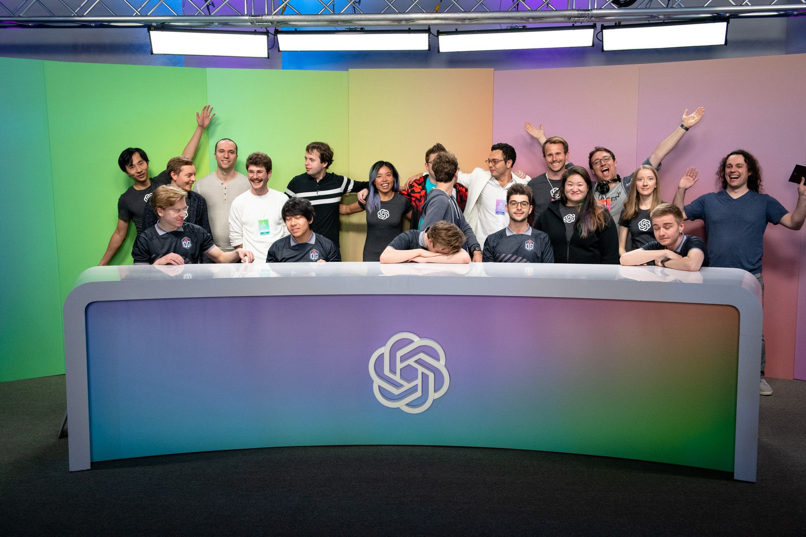

# OpenAI Five

## Summary

<!--kg-card-begin: markdown-->

At OpenAI, we’ve used the multiplayer video game <a href="https://www.dota2.com/play/">Dota 2</a> as a research platform for general-purpose AI systems. Our Dota 2 AI, called OpenAI Five, learned by playing over 10,000 years of games against itself. It demonstrated the ability to achieve <a href="https://openai.com/blog/openai-five-defeats-dota-2-world-champions">expert-level performance</a>, learn <a href="https://openai.com/blog/openai-five-defeats-dota-2-world-champions/#cooperativemode">human–AI cooperation</a>, and

## Content

<!--kg-card-begin: markdown-->

At OpenAI, we’ve used the multiplayer video game <a href="https://www.dota2.com/play/">Dota 2</a> as a research platform for general-purpose AI systems. Our Dota 2 AI, called OpenAI Five, learned by playing over 10,000 years of games against itself. It demonstrated the ability to achieve <a href="https://openai.com/blog/openai-five-defeats-dota-2-world-champions">expert-level performance</a>, learn <a href="https://openai.com/blog/openai-five-defeats-dota-2-world-champions/#cooperativemode">human–AI cooperation</a>, and <a href="https://openai.com/blog/openai-five-defeats-dota-2-world-champions/#arena">operate at internet scale</a>.

<section class="btns"><a class="btn btn-padded icon-paper" href="https://arxiv.org/abs/1912.06680">Read Paper</a><a class="btn btn-padded icon-papers" href="https://openai.com/blog/tags/dota-2/">Read Blog Posts</a></section>
<!--kg-card-end: markdown-->