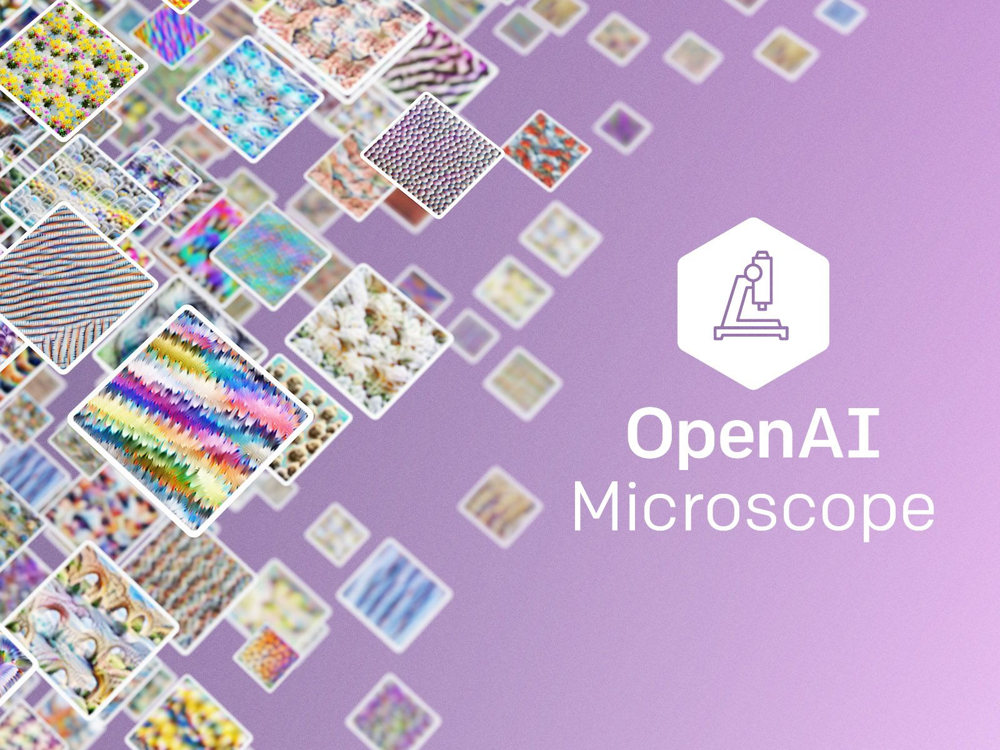
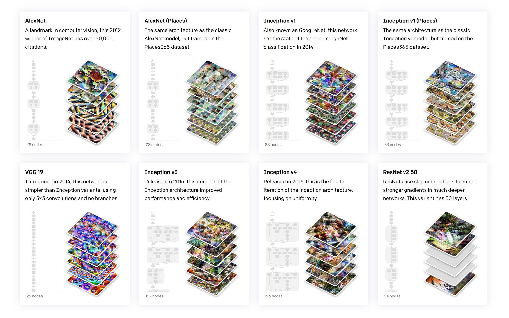
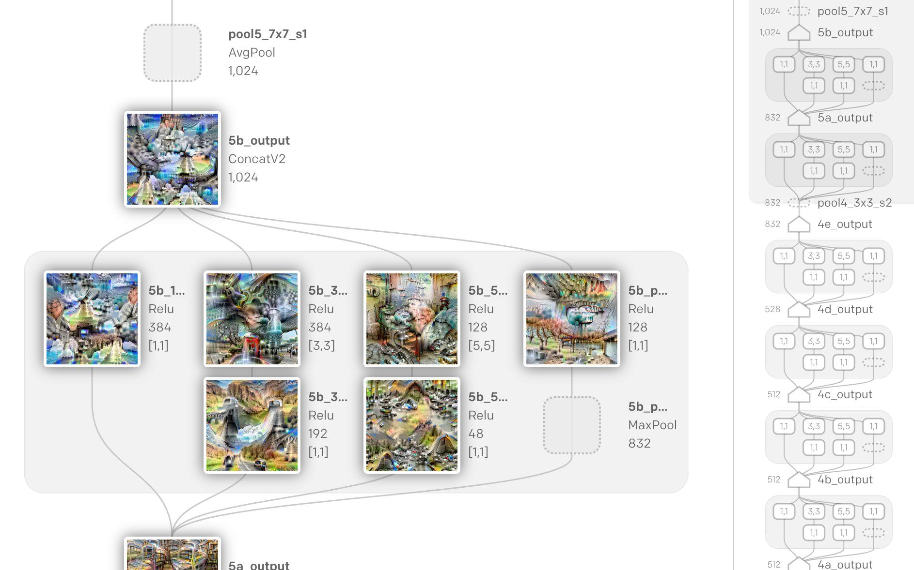

# OpenAI Microscope

## Summary

<!--kg-card-begin: markdown-->

<video autoplay="" class="w-100 mb-0" loop="" muted="" playsinline="" poster="https://cdn.openai.com/microscope/microscope-video-poster.jpg" src="https://cdn.openai.com/microscope/microscope-header-web-medium-bitrate.mp4">
</video>

We’re introducing <a href="https://microscope.openai.com">OpenAI Microscope</a>, a collection of visualizations of every significant layer and neuron of eight vision “model organisms” which are often studied in interpretability. Microscope makes it easier to analyze the features that form inside these neural networks, and we hope it will help the research community as

## Content

<!--kg-card-begin: markdown-->

<video autoplay="" class="w-100 mb-0" loop="" muted="" playsinline="" poster="https://cdn.openai.com/microscope/microscope-video-poster.jpg" src="https://cdn.openai.com/microscope/microscope-header-web-medium-bitrate.mp4">
</video>

We’re introducing <a href="https://microscope.openai.com">OpenAI Microscope</a>, a collection of visualizations of every significant layer and neuron of eight vision “model organisms” which are often studied in interpretability. Microscope makes it easier to analyze the features that form inside these neural networks, and we hope it will help the research community as we move towards understanding these complicated systems.

<section class="btns">
<a class="btn btn-padded right icon-external" href="https://microscope.openai.com/">Browse Microscope</a>
</section>

The abilities of modern neural networks are the result of the interactions of thousands of neurons (sometimes tens of thousands or more!). In order to understand their behavior, we’d like to be able to quickly and easily investigate these neurons interactions in detail, and share those observations. This is especially true in collaborative environments. For instance, one researcher might speculate:

<blockquote>

InceptionV1 <a href="https://microscope.openai.com/models/inceptionv1/mixed4c_0/447">4c:447</a> is a car detector which is built from a wheel detector (<a href="https://microscope.openai.com/models/inceptionv1/mixed4b_0/373">4b:373</a>) and a window detector (<a href="https://microscope.openai.com/models/inceptionv1/mixed4b_0/237">4b:237</a>).

</blockquote>

When someone makes a claim like this, it’s useful if others can quickly explore those neurons, evaluating the claim and discovering new things. This is the goal of the OpenAI Microscope.

Microscope systematically visualizes every neuron in several commonly studied vision models, and makes all of those neurons linkable. We hope this  will support the interpretability community in several ways:

<ol>
<li>Although these models and visualizations are already open source (we help maintain the <a href="https://github.com/tensorflow/lucid/">lucid library</a>, which is used to generate all the visualizations in Microscope) visualizing neurons is tedious. Microscope changes the feedback loop of exploring neurons from minutes to seconds. This quick feedback loop has been essential for us in discovering unexpected features like high-low frequency detectors in the ongoing <a href="https://distill.pub/2020/circuits/zoom-in/">circuits project</a>.</li>
<li>Making models and neurons linkable allows immediate scrutiny and further exploration of research making claims about those neurons. It also removes potential confusion about which model and neuron is being discussed (which of the five versions of InceptionV1 are we talking about again?). This is really helpful for collaboration, especially when researchers are at different institutions.</li>
<li>One of the wonderful things about interpretability as an area of ML is how accessible it is. Compared to many other areas, it requires comparatively little access to compute. But systematically visualizing neural networks can still take hundreds of GPU hours. We hope that, by sharing our visualizations, we can help keep interpretability highly accessible.</li>
</ol>

Just as biologists often focus on the study of a few “model organisms,” Microscope focuses on exploring a small number of models in detail. Our initial release includes nine frequently studied vision models, along with several visualization techniques we’ve found particularly useful in studying them. We plan to expand to other models and techniques in the coming months.

We’re excited to see how the community will use Microscope, and we encourage you to reuse these assets. In particular, we think it has a lot of potential in supporting the <a href="https://distill.pub/2020/circuits/zoom-in/">Circuits collaboration</a>—a project to reverse engineer neural networks by analyzing individual neurons and their connections—or similar work.

<section class="btns mt-1.5">
<a class="btn btn-padded right icon-external" href="https://microscope.openai.com/">Browse Microscope</a>
</section>
<!--kg-card-end: markdown-->