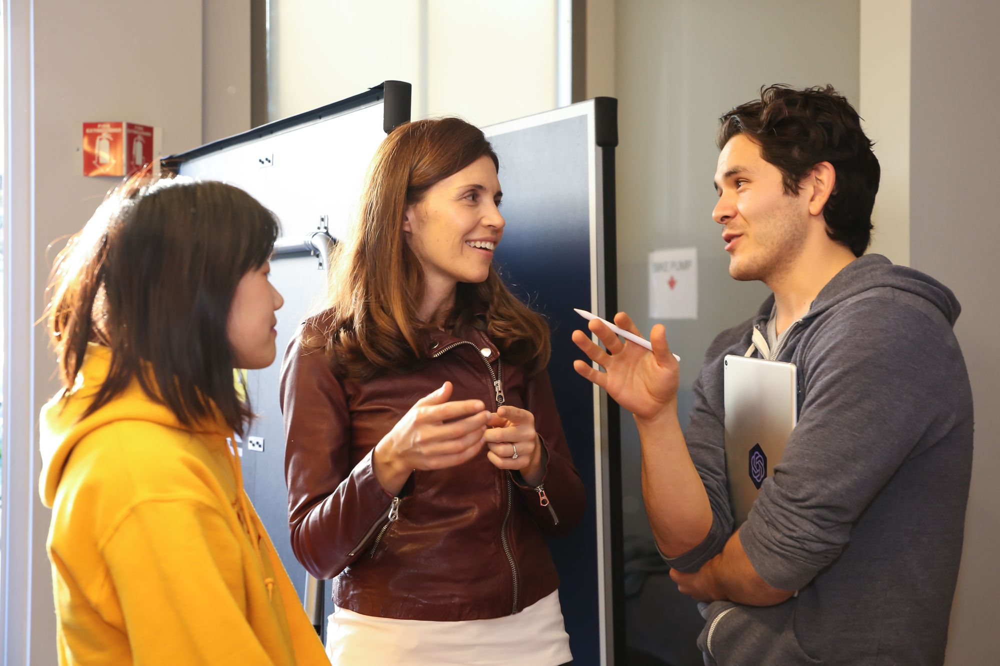
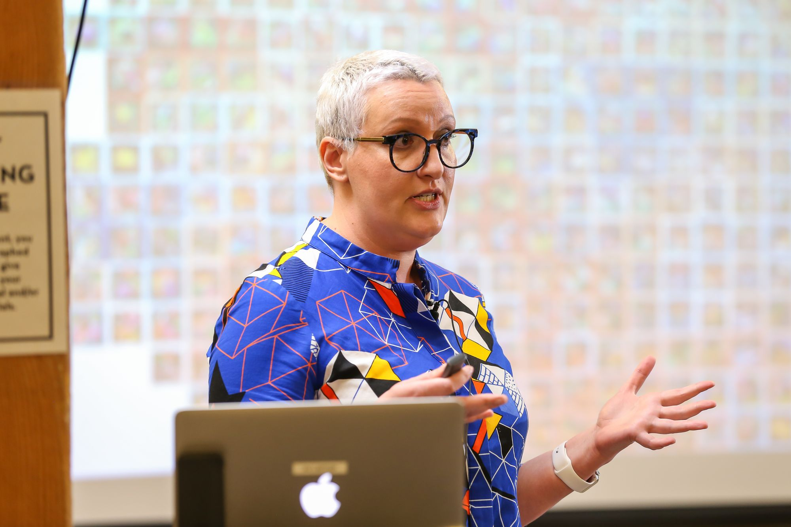
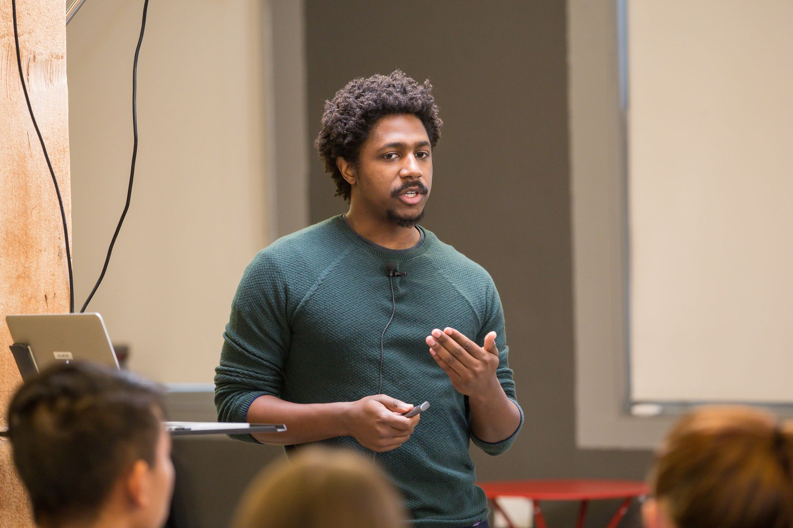
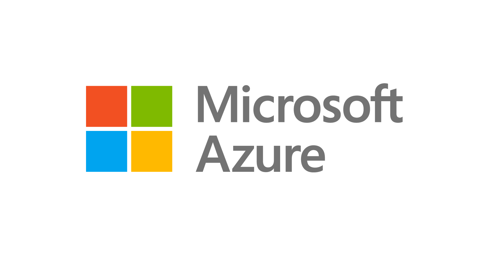

# OpenAI Scholars Spring 2020

## Summary

<!--kg-card-begin: markdown-->

We are now accepting applications for our third class of OpenAI Scholars, a 4-month full-time program where we provide stipends and mentorship to 8 individuals from <a href="https://www.nsf.gov/statistics/2017/nsf17310/digest/introduction/">underrepresented groups</a> to study deep learning and produce open-source a project. The second class of Scholars recently released their <a href="https://openai.com/blog/openai-scholars-class-of-19/">projects</a> and presented their work

## Content

<!--kg-card-begin: markdown-->

We are now accepting applications for our third class of OpenAI Scholars, a 4-month full-time program where we provide stipends and mentorship to 8 individuals from <a href="https://www.nsf.gov/statistics/2017/nsf17310/digest/introduction/">underrepresented groups</a> to study deep learning and produce open-source a project. The second class of Scholars recently released their <a href="https://openai.com/blog/openai-scholars-class-of-19/">projects</a> and presented their work at the 2019 Scholars <a href="https://www.youtube.com/watch?v=4u218xVkjmQ">Demo Day.</a>

<section class="btns"><a class="btn btn-padded icon-external right disabled" href="https://jobs.lever.co/openai/d30e1f04-b548-4503-ba8b-9853cb49bdc7">Apply now</a></section>
<h3 id="whyweredoingthis">Why we're doing this</h3>

Diversity is core to AI having a positive effect on the world—it’s necessary to ensure the advanced AI systems in the future are built to benefit everyone. While we hope that some of the scholars will join OpenAI, we want this program to improve diversity in the field at large.

2019 Spring Scholar Janet Brown presenting <a href="https://www.quaternionidentity.com/blog/visualization-gans-act-atlas">Visualizing &amp; Evaluating Image Synthesis GANs
using the Techniques of Activation Atlases</a>

2019 Spring Scholar Jonathan Michaux presenting <a href="https://jmichaux.github.io/intrinsic-motivation/">Using Intrinsic Motivation to Solve Robotic Tasks with Sparse Rewards</a>

<h3 id="timeframe">Timeframe</h3>

<table style="border-spacing: 0;">
<tr>
<td>9/23/2019</td>
<td>Open applications</td>
</tr>
<tr>
<td>11/15/2019</td>
<td>Close applications</td>
</tr>
<tr>
<td>12/13/2019</td>
<td>Notify all accepted applicants</td>
</tr>
<tr>
<td>2/3/2020</td>
<td>Welcome dinner—cohort start (onsite in SF)</td>
</tr>
<tr>
<td>5/29/2020</td>
<td>Final project due—cohort end</td>
</tr>
<tr>
<td>6/5/2020</td>
<td>Demo day (onsite)</td>
</tr>
</table>

<h3 id="whatweprovide">What we provide</h3>
<ul>
<li>$8.5k/mo stipend for 4 months from February 3, 2020 through June 5, 2020.</li>
<li>$25,000 worth of credits from Microsoft Azure.</li>
<li>Access to a group Slack with the scholars and mentors.</li>
<li>For Bay Area participants, we offer an optional desk at the OpenAI office (which our past Scholars have found very valuable).</li>
<li>A mentor who will collaborate with you 1:1 weekly via video call, answer your questions via chat/email, and work with you to design and execute a project that will stretch your skills. Mentors for this class include:</li>
</ul>

<a href="http://christinemcleavey.com/">
<figure class="bg-cover aspect-1/1 rounded-circle" style="background-image:url(/content/images/2019/10/christine.jpg)"></figure>

Christine Payne

</a>

<a href="http://jotterbach.github.io/">
<figure class="bg-cover aspect-1/1 rounded-circle" style="background-image:url(/content/images/2019/10/johannes.jpg)">
</figure>

Johannes Otterbach

</a>

<a href="https://blog.millionintegrals.com/">
<figure class="bg-cover aspect-1/1 rounded-circle" style="background-image:url(/content/images/2019/10/jerry.jpg)">
</figure>

Jerry Tworek

</a>

<a href="http://twitter.com/alecrad">
<figure class="bg-cover aspect-1/1 rounded-circle" style="background-image:url(/content/images/2019/10/alec.jpg)"></figure>

Alec Radford

</a>

<a href="https://github.com/kcobbe">
<figure class="bg-cover aspect-1/1 rounded-circle" style="background-image:url(/content/images/2019/10/karl.jpg)"></figure>

Karl Cobbe

</a>

<a href="http://www.melaniesubbiah.com/">
<figure class="bg-cover aspect-1/1 rounded-circle" style="background-image:url(/content/images/2019/10/melanie.jpg)"></figure>

Melanie Subbiah

</a>

<a href="https://twitter.com/sabrinaosmany?lang=en">
<figure class="bg-cover aspect-1/1 rounded-circle" style="background-image:url(/content/images/2019/10/sabrina.jpg)"></figure>

Sabrina Osmany

</a>

<h3 id="whatwerelookingfor">What we're looking for</h3>

We’re open to <strong>all experience levels and backgrounds</strong> that meet the below criteria—it’s a common myth that you need a PhD to work in AI (many OpenAI employees don’t have one).

We look for people who are comfortable writing software (2+ years in software engineering), but no previous machine learning experience is required. This is a remote program open to anyone already with US work authorization located in US timezones. We ask all Scholars to <a href="https://fatmatarlaci.wordpress.com/">document</a> their experiences studying deep learning to hopefully inspire others to join the field too.

You are eligible to apply if:

<ul>
<li>You are a member of an <a href="https://www.nsf.gov/statistics/2017/nsf17310/digest/introduction/">underrepresented group</a> in science and engineering. Our goal is for this program to be as inclusive as possible. if you feel you belong to a group not listed here that is underrepresented in science and engineering, please apply and mention it in your application.</li>
<li>You have 2+ years experience in software engineering (no machine learning experience required)</li>
<li>You already have US work authorization and are located in the United States for the duration of the program.</li>
<li>You are comfortable programming in Python (other languages are helpful, but you’ll spend the program writing in Python).</li>
</ul>

We’ll use these criteria for selection:

<ul>
<li><strong>Technical skills.</strong> The stronger your technical background, the more time you’ll spend focusing on the deep learning itself.</li>
<li><strong>Self-motivation.</strong> We’re looking for people who are experienced in being self-directed on large and challenging projects, and who will be successful at independent work.</li>
<li><strong>Leadership abilities.</strong> We want to hear from people who are interested in community building and who will work to inspire others (in the program and externally) to endeavor to learn deep learning as well.</li>
</ul>

<strong>Applications will be evaluated on a rolling basis.</strong>

<em>Questions? Email <a href="mailto:scholars@openai.com">scholars@openai.com</a></em>

<section class="btns"><a class="btn btn-padded icon-external right disabled" href="https://jobs.lever.co/openai/d30e1f04-b548-4503-ba8b-9853cb49bdc7">Apply now</a></section>

Thanks to Microsoft for providing compute credits for our Scholars.

<!--kg-card-end: markdown-->