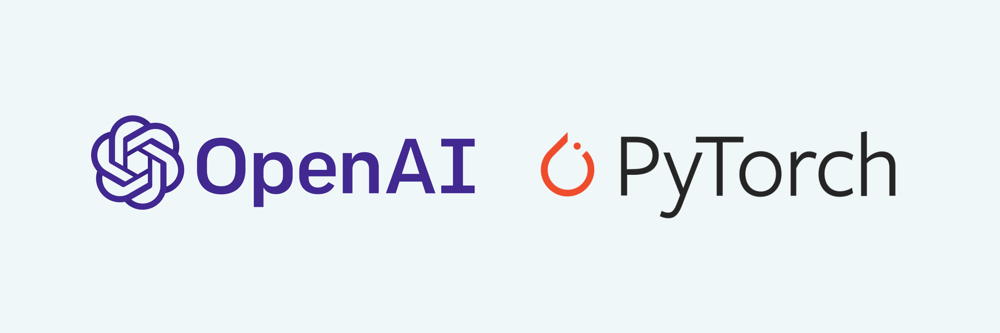
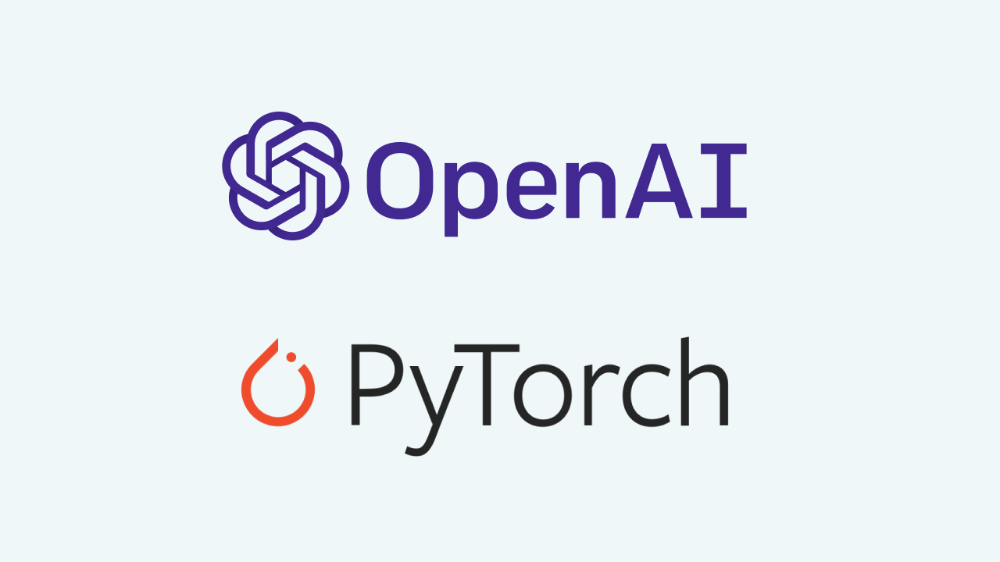

# OpenAI → PyTorch
###### <!--kg-card-begin: markdown-->
We are standardizing OpenAI’s deep learning framework on <a href="https://pytorch.org/">PyTorch</a>. In the past, we implemented projects in many frameworks depending on their relative strengths. We’ve now chosen to standardize to make it easier for our team to create and share optimized implementations of our models.

As part of this

<!--kg-card-begin: markdown-->
We are standardizing OpenAI’s deep learning framework on <a href="https://pytorch.org/">PyTorch</a>. In the past, we implemented projects in many frameworks depending on their relative strengths. We’ve now chosen to standardize to make it easier for our team to create and share optimized implementations of our models.

As part of this move, we’ve just released a <a href="https://github.com/openai/spinningup">PyTorch-enabled version</a> of <a href="https://openai.com/blog/spinning-up-in-deep-rl/">Spinning Up in Deep RL</a>, an open-source educational resource produced by OpenAI that makes it easier to learn about deep reinforcement learning. We are also in the process of writing PyTorch bindings for our highly-optimized <a href="https://openai.com/blog/block-sparse-gpu-kernels/">blocksparse kernels</a>, and will open-source those bindings in upcoming months.

The main reason we've chosen PyTorch is to increase our research productivity at scale on GPUs. It is very easy to try and execute new research ideas in PyTorch; for example, switching to PyTorch decreased our iteration time on research ideas in generative modeling from weeks to days. We’re also excited to be joining a rapidly-growing developer community, including organizations like Facebook and Microsoft, in pushing scale and performance on GPUs.

Going forward we'll primarily use PyTorch as our deep learning framework but sometimes use other ones when there's a specific technical reason to do so. Many of our teams have already made the switch, and we look forward to contributing to the PyTorch community in upcoming months.

<!--kg-card-end: markdown-->