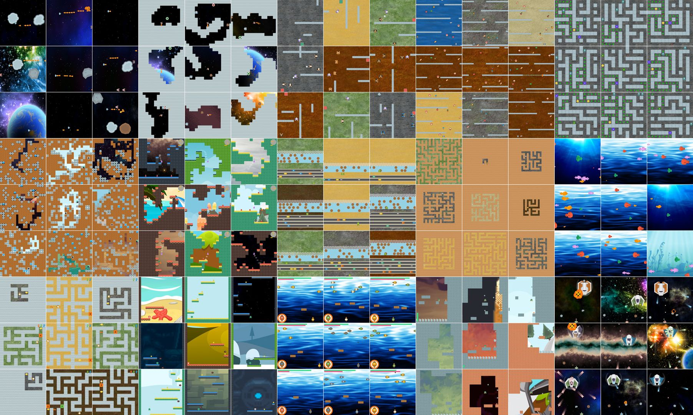

# Procgen Benchmark
## Summary
We’re releasing Procgen Benchmark, 16 simple-to-use procedurally-generated environments which provide a direct measure of how quickly a reinforcement learning agent learns generalizable skills.
## Content
We’re releasing Procgen Benchmark, 16 simple-to-use procedurally-generated environments which provide a direct measure of how quickly a reinforcement learning agent learns generalizable skills.
<!--kg-card-begin: markdown-->

We’re releasing Procgen Benchmark, 16 simple-to-use <a href="https://en.wikipedia.org/wiki/Procedural_generation">procedurally-generated</a> environments which provide a direct measure of how quickly a reinforcement learning agent learns generalizable skills.

<section class="btns">
<a class="btn btn-padded icon-paper" href="https://arxiv.org/abs/1912.01588">Paper</a>
<a class="btn btn-padded icon-code" href="https://github.com/openai/procgen">Environment Code</a>
<a class="btn btn-padded icon-code" href="https://github.com/openai/train-procgen">Training Code</a>
</section>
<!-- carousel -->

CoinRun

<video autoplay="" class="w-100 mb-0" loop="" muted="" playsinline="" poster="https://cdn.openai.com/procgen-benchmark/assets/env_coinrun.jpg" src="https://cdn.openai.com/procgen-benchmark/assets/env_coinrun.mp4"></video>

StarPilot

<video autoplay="" class="w-100 mb-0" loop="" muted="" playsinline="" poster="https://cdn.openai.com/procgen-benchmark/assets/env_starpilot.jpg" src="https://cdn.openai.com/procgen-benchmark/assets/env_starpilot.mp4"></video>

CaveFlyer

<video autoplay="" class="w-100 mb-0" loop="" muted="" playsinline="" poster="https://cdn.openai.com/procgen-benchmark/assets/env_caveflyer.jpg" src="https://cdn.openai.com/procgen-benchmark/assets/env_caveflyer.mp4"></video>

Dodgeball

<video autoplay="" class="w-100 mb-0" loop="" muted="" playsinline="" poster="https://cdn.openai.com/procgen-benchmark/assets/env_dodgeball.jpg" src="https://cdn.openai.com/procgen-benchmark/assets/env_dodgeball.mp4"></video>

FruitBot

<video autoplay="" class="w-100 mb-0" loop="" muted="" playsinline="" poster="https://cdn.openai.com/procgen-benchmark/assets/env_fruitbot.jpg" src="https://cdn.openai.com/procgen-benchmark/assets/env_fruitbot.mp4"></video>

Chaser

<video autoplay="" class="w-100 mb-0" loop="" muted="" playsinline="" poster="https://cdn.openai.com/procgen-benchmark/assets/env_chaser.jpg" src="https://cdn.openai.com/procgen-benchmark/assets/env_chaser.mp4"></video>

Miner

<video autoplay="" class="w-100 mb-0" loop="" muted="" playsinline="" poster="https://cdn.openai.com/procgen-benchmark/assets/env_miner.jpg" src="https://cdn.openai.com/procgen-benchmark/assets/env_miner.mp4"></video>

Jumper

<video autoplay="" class="w-100 mb-0" loop="" muted="" playsinline="" poster="https://cdn.openai.com/procgen-benchmark/assets/env_jumper.jpg" src="https://cdn.openai.com/procgen-benchmark/assets/env_jumper.mp4"></video>

Leaper

<video autoplay="" class="w-100 mb-0" loop="" muted="" playsinline="" poster="https://cdn.openai.com/procgen-benchmark/assets/env_leaper.jpg" src="https://cdn.openai.com/procgen-benchmark/assets/env_leaper.mp4"></video>

Maze

<video autoplay="" class="w-100 mb-0" loop="" muted="" playsinline="" poster="https://cdn.openai.com/procgen-benchmark/assets/env_maze.jpg" src="https://cdn.openai.com/procgen-benchmark/assets/env_maze.mp4"></video>

BigFish

<video autoplay="" class="w-100 mb-0" loop="" muted="" playsinline="" poster="https://cdn.openai.com/procgen-benchmark/assets/env_bigfish.jpg" src="https://cdn.openai.com/procgen-benchmark/assets/env_bigfish.mp4"></video>

Heist

<video autoplay="" class="w-100 mb-0" loop="" muted="" playsinline="" poster="https://cdn.openai.com/procgen-benchmark/assets/env_heist.jpg" src="https://cdn.openai.com/procgen-benchmark/assets/env_heist.mp4"></video>

Climber

<video autoplay="" class="w-100 mb-0" loop="" muted="" playsinline="" poster="https://cdn.openai.com/procgen-benchmark/assets/env_climber.jpg" src="https://cdn.openai.com/procgen-benchmark/assets/env_climber.mp4"></video>

Plunder

<video autoplay="" class="w-100 mb-0" loop="" muted="" playsinline="" poster="https://cdn.openai.com/procgen-benchmark/assets/env_plunder.jpg" src="https://cdn.openai.com/procgen-benchmark/assets/env_plunder.mp4"></video>

Ninja

<video autoplay="" class="w-100 mb-0" loop="" muted="" playsinline="" poster="https://cdn.openai.com/procgen-benchmark/assets/env_ninja.jpg" src="https://cdn.openai.com/procgen-benchmark/assets/env_ninja.mp4"></video>

BossFight

<video autoplay="" class="w-100 mb-0" loop="" muted="" playsinline="" poster="https://cdn.openai.com/procgen-benchmark/assets/env_bossfight.jpg" src="https://cdn.openai.com/procgen-benchmark/assets/env_bossfight.mp4"></video>

<!-- end .js-carousel-videos -->

<!-- end .container -->

<!-- end .full -->
<h3 id="gettingstarted">Getting started</h3>

Using the environment is easy whether you’re a human or AI:

<pre><code class="language-bash">$ pip install procgen # install
$ python -m procgen.interactive --env-name starpilot # human
$ python &lt;&lt;EOF # random AI agent
import gym
env = gym.make('procgen:procgen-coinrun-v0')
obs = env.reset()
while True:
    obs, rew, done, info = env.step(env.action_space.sample())
    env.render()
    if done:
        break
EOF
</code></pre>

We’ve found that all of the Procgen environments require training on 500–1000 different levels before they can generalize to new levels, which suggests that standard RL benchmarks need much more diversity within each environment. Procgen Benchmark has become the standard research platform used by the OpenAI RL team, and we hope that it accelerates the community in creating better RL algorithms.

<h3 id="environmentdiversityiskey">Environment diversity is key</h3>

<a href="https://arxiv.org/abs/1804.06893">In</a> <a href="https://openai.com/blog/quantifying-generalization-in-reinforcement-learning/">several</a> <a href="https://arxiv.org/abs/1806.10729">environments</a>, it has been observed that agents can overfit to remarkably large training sets. This evidence raises the possibility that overfitting pervades classic benchmarks like the <a href="https://arxiv.org/abs/1207.4708">Arcade Learning Environment</a>, which has long served as a gold standard in reinforcement learning (RL). While the diversity between different games in the ALE is one of the benchmark's greatest strengths, the low emphasis on generalization presents a significant drawback. In each game the question must be asked: are agents robustly learning a relevant skill, or are they approximately memorizing specific trajectories?

<a href="https://openai.com/blog/quantifying-generalization-in-reinforcement-learning/">CoinRun</a> was designed to address precisely this issue, by using procedural generation to construct distinct sets of training levels and test levels. While CoinRun has helped us better quantify generalization in RL, it is still only a single environment. It’s likely that CoinRun is not fully representative of the many challenges RL agents must face. We want the best of both worlds: a benchmark comprised of many diverse environments, each of which fundamentally requires generalization. To fulfill this need, we have created Procgen Benchmark. CoinRun now serves as the inaugural environment in Procgen Benchmark, contributing its diversity to a greater whole.

Previous work, including the <a href="https://arxiv.org/abs/1902.01378">Obstacle Tower Challenge</a> and the <a href="https://arxiv.org/abs/1802.10363">General Video Game AI framework</a>, has also encouraged using procedural generation to better evaluate generalization in RL. We've designed environments in a similar spirit, with two Procgen environments drawing direct inspiration from <a href="https://arxiv.org/abs/1806.10729">GVGAI-based work</a>. Other environments like Dota and StarCraft also provide lots of per-environment complexity, but these environments are hard to rapidly iterate with (and it's even harder to use more than one such environment at a time). With Procgen Benchmark, we strive for all of the following: experimental convenience, high diversity within environments, and high diversity across environments.

<h3 id="procgenbenchmark">Procgen Benchmark</h3>

Procgen Benchmark consists of 16 unique environments designed to measure both sample efficiency and generalization in reinforcement learning. This benchmark is ideal for evaluating generalization since distinct training and test sets can be generated in each environment. This benchmark is also well-suited to evaluate sample efficiency, since all environments pose diverse and compelling challenges for RL agents. The environments' intrinsic diversity demands that agents learn robust policies; overfitting to narrow regions in state space will not suffice. Put differently, the ability to generalize becomes an integral component of success when agents are faced with ever-changing levels.

<h3 id="designprinciples">Design principles</h3>

We’ve designed all Procgen environments to satisfy the following criteria:

<ul>
<li>

<strong>High Diversity</strong>: Environment generation logic is given maximal freedom, subject to basic design constraints. The diversity in the resulting level distributions presents agents with meaningful generalization challenges.

</li>
<li>

<strong>Fast Evaluation</strong>: Environment difficulty is calibrated such that baseline agents make significant progress after training for 200M timesteps. Moreover, the environments are optimized to perform thousands of steps per second on a single CPU core, enabling a fast experimental pipeline.

</li>
<li>

<strong>Tunable Difficulty</strong>: All environments support two well-calibrated difficulty settings: easy and hard. While we report results using the hard difficulty setting, we make the easy difficulty setting available for those with limited access to compute power. Easy environments require approximately an eighth of the resources to train.

</li>
<li>

<strong>Emphasis on Visual Recognition and Motor Control</strong>: In keeping with precedent, environments mimic the style of many Atari and Gym Retro games. Performing well primarily depends on identifying key assets in the observation space and enacting appropriate low level motor responses.

</li>
</ul>
<h3 id="evaluatinggeneralization">Evaluating generalization</h3>

We came to appreciate how hard RL generalization can be while conducting the <a href="https://openai.com/blog/first-retro-contest-retrospective/">Retro Contest</a>, as agents continually failed to generalize from the limited data in the training set. Later, our CoinRun experiments painted an even clearer picture of our agents' struggle to generalize. We've now expanded on those results, conducting our most thorough study of RL generalization to date using all 16 environments in Procgen Benchmark.

We first measured how the size of the training set impacts generalization. In each environment, we generated training sets ranging in size from 100 to 100,000 levels. We trained agents for 200M timesteps on these levels using <a href="https://openai.com/blog/openai-baselines-ppo/">Proximal Policy Optimization</a>, and we measured performance on unseen test levels.

<h5 class="mb-0" id="generalization">Generalization performance</h5>

Score over 100k levels, log scale

CoinRun

StarPilot

CaveFlyer

Dodgeball

FruitBot

Chaser

Miner

Jumper

Leaper

Maze

BigFish

Heist

Climber

Plunder

Ninja

BossFight

<!-- end.row -->

<!-- end .wide-->

We found that agents strongly overfit to small training sets in almost all environments. In some cases, agents need access to as many as 10,000 levels to close the generalization gap. We also saw a peculiar trend emerge in many environments: past a certain threshold, training performance improves as the training sets grows! This runs counter to trends found in supervised learning, where training performance commonly decreases with the size of the training set. We believe this increase in training performance comes from an implicit curriculum provided by a diverse set of levels. A larger training set can improve training performance if the agent learns to generalize <em>even across levels in the training set</em>. We previously noticed this effect with CoinRun, and have found it often occurs in many Procgen environments as well.

<h3 id="anablationwithdeterministiclevels">An ablation with deterministic levels</h3>

We also conducted a simple ablation study to emphasize the importance of procedural generation. Instead of using a new level at the start of every episode, we trained agents on a fixed sequence of levels. The agent begins each episode on the first level, and when it successfully completes a level, it progresses to the next one. If the agent fails at any point, the episode terminates. The agent can reach arbitrarily many levels, though in practice it rarely progresses beyond the 20th level in any environment.

<h5 class="mb-0" id="ablation">Train and test performance</h5>

Score over 200M timesteps

CoinRun

StarPilot

CaveFlyer

Dodgeball

FruitBot

Chaser

Miner

Jumper

Leaper

Maze

BigFish

Heist

Climber

Plunder

Ninja

BossFight

<!-- end.row -->

<!-- end .wide-->

At test time, we remove the determinism in the sequence of levels, instead choosing level sequences at random. We find that agents become competent over the first several training levels in most games, giving an illusion of meaningful progress. However, test performance demonstrates that the agents have in fact learned almost nothing about the underlying level distribution. We believe this vast gap between training and test performance is worth highlighting. It reveals a crucial hidden flaw in training on environments that follow a fixed sequence of levels. These results show just how essential it is to use diverse environment distributions when training and evaluating RL agents.

<h3 id="nextsteps">Next steps</h3>

We expect many insights gleaned from this benchmark to apply in more complex settings, and we’re excited to use these new environments to design more capable and efficient agents.

<em>If you’re interested in helping develop diverse environments, <a href="https://openai.com/jobs/">we’re hiring</a>!</em>

<footer class="post-footer js-post-footer">
<!-- footer item -->

Acknowledgments

Thanks to Marc Bellemare, Julian Togelius, Carles Gelada, Jacob Jackson, Alex Ray, Lilian Weng, and Joshua Achiam for their feedback on the paper.

Thanks to Mira Murati, Brooke Chan, Justin Jay Wang, Greg Brockman, Ashley Pilipiszyn and Jack Clark for their work supporting, designing, writing, and providing feedback on this post.

Special thanks to <a href="https://www.kenney.nl">Kenney</a> for the many high quality game assets used throughout these environments.

Additional thanks to <a href="https://craftpix.net">CraftPix.net</a> for several game backgrounds, as well as to <a href="https://www.gameartguppy.com">GameArtGuppy</a>, and <a href="https://ansimuz.itch.io">ansimuz</a>. All asset licenses can be found <a href="https://github.com/openai/procgen/blob/master/ASSET_LICENSES.md">here</a>.

</footer>
<!--kg-card-end: markdown-->