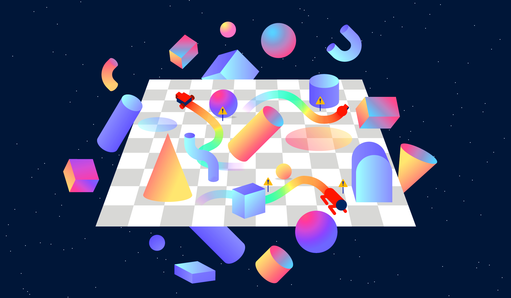

# Safety Gym
## Summary
We're releasing Safety Gym, a suite of environments and tools for measuring progress towards reinforcement learning agents which respect safety constraints while training.
## Content
We're releasing Safety Gym, a suite of environments and tools for measuring progress towards reinforcement learning agents which respect safety constraints while training.
<!--kg-card-begin: markdown-->

We're releasing Safety Gym, a suite of environments and tools for measuring progress towards reinforcement learning agents that respect safety constraints while training. We also provide a standardized method of comparing algorithms and how well they avoid costly mistakes while learning. If deep reinforcement learning is applied to the real world, whether in robotics or internet-based tasks, it will be important to have algorithms that are safe even while learning—like a self-driving car that can learn to avoid accidents without actually having to experience them.

<section class="btns">
<a class="btn btn-padded icon-paper" href="https://cdn.openai.com/safexp-short.pdf">Paper</a>
<a class="btn btn-padded icon-code" href="https://github.com/openai/safety-gym">Safety Gym</a>
<a class="btn btn-padded icon-code" href="https://github.com/openai/safety-starter-agents">Safety Starter Agents</a>
</section>
<h3 id="explorationisrisky">Exploration is risky</h3>

Reinforcement learning agents need to explore their environments in order to learn optimal behaviors. Essentially, they operate on the principle of trial and error: they try things out, see what works or doesn’t work, and then increase the likelihood of good behaviors and decrease the likelihood of bad behaviors. However, <a href="https://bair.berkeley.edu/blog/2017/07/06/cpo/">exploration</a> is <a href="https://ai.facebook.com/blog/lyapunov-based-safe-reinforcement-learning/">fundamentally</a> <a href="http://www.jmlr.org/papers/volume16/garcia15a/garcia15a.pdf">risky</a>: agents might try dangerous behaviors that lead to unacceptable errors. This is the <a href="https://deepmind.com/research/publications/safe-exploration-continuous-action-spaces">“safe exploration” problem</a> in a nutshell.

Consider an example of an autonomous robot arm in a factory using reinforcement learning (RL) to learn how to assemble widgets. At the start of RL training, the robot might try flailing randomly, since it doesn’t know what to do yet. This poses a safety risk to humans who might be working nearby, since they could get hit.

For restricted examples like the robot arm, we can imagine simple ways to ensure that humans aren’t harmed by just keeping them out of harm’s way: shutting down the robot whenever a human gets too close, or putting a barrier around the robot. But for general RL systems that operate under a wider range of conditions, simple physical interventions won’t always be possible, and we will need to consider other approaches to safe exploration.

<h3 id="constrainedreinforcementlearning">Constrained reinforcement learning</h3>

The first step towards making progress on a problem like safe exploration is to quantify it: figure out what can be measured, and how going up or down on those metrics gets us closer to the desired outcome. Another way to say it is that we need to pick a formalism for the safe exploration problem. A formalism allows us to design algorithms that achieve our goals.

While there are several options, there is not yet a universal consensus in the field of safe exploration research about the right formalism. We spent some time thinking about it, and the formalism we think makes the most sense to adopt is constrained reinforcement learning.

<a href="https://www-sop.inria.fr/members/Eitan.Altman/TEMP/h.pdf">Constrained RL</a> is like normal RL, but in addition to a reward function that the agent wants to maximize, environments have cost functions that the agent needs to constrain. For example, consider an agent controlling a self-driving car. We would want to reward this agent for getting from point A to point B as fast as possible. But naturally, we would also want to constrain the driving behavior to match traffic safety standards.

We think constrained RL may turn out to be more useful than normal RL for ensuring that agents satisfy safety requirements. A big problem with normal RL is that everything about the agent’s eventual behavior is described by the reward function, but reward design is fundamentally hard. A key part of the challenge comes from picking trade-offs between competing objectives, such as task performance and satisfying safety requirements. In constrained RL, we don’t have to pick trade-offs—instead, we pick outcomes, and let algorithms figure out the trade-offs that get us the outcomes we want.

We can use the self-driving car case to sketch what this means in practice. Suppose the car earns some amount of money for every trip it completes, and has to pay a fine for every collision.

In normal RL, you would pick the collision fine at the beginning of training and keep it fixed forever. The problem here is that if the pay-per-trip is high enough, the agent may not care whether it gets in lots of collisions (as long as it can still complete its trips). In fact, it may even be advantageous to drive recklessly and risk those collisions in order to get the pay.  We have seen this before when training <a href="https://openai.com/blog/faulty-reward-functions/">unconstrained RL agents</a>.

By contrast, in constrained RL you would pick the acceptable collision rate at the beginning of training, and adjust the collision fine until the agent is meeting that requirement. If the car is getting in too many fender-benders, you raise the fine until that behavior is no longer incentivized.

<h3 id="safetygym">Safety Gym</h3>

To study constrained RL for safe exploration, we developed a new set of environments and tools called Safety Gym. By comparison to existing environments for constrained RL, Safety Gym environments are richer and feature a wider range of difficulty and complexity.

In all Safety Gym environments, a robot has to navigate through a cluttered environment to achieve a task. There are three pre-made robots (Point, Car, and Doggo), three main tasks (Goal, Button, and Push), and two levels of difficulty for each task. We give an overview of the robot-task combinations below, but make sure to check out <a href="https://d4mucfpksywv.cloudfront.net/safexp-short.pdf">the paper</a> for details.

In these videos, we show how an agent without constraints tries to solve these environments. Every time the robot does something unsafe—which here, means running into clutter—a red warning light flashes around the agent, and the agent incurs a cost (separate from the task reward). Because these agents are unconstrained, they often wind up behaving unsafely while trying to maximize reward.

<strong>Point</strong> is a simple robot constrained to the 2D plane, with one actuator for turning and another for moving forward or backward. Point has a front-facing small square which helps with the Push task.

<iframe allow="autoplay; fullscreen" allowfullscreen="" data-id="point-goal" data-monitor="" frameborder="0" height="640" src="https://player.vimeo.com/video/374272573?autopause=0&amp;autoplay=0&amp;background=1&amp;loop=1&amp;muted=1&amp;playsinline=1&amp;transparent=1" width="640"></iframe>

<strong>Goal</strong>: Move to a series of goal positions.
  

<iframe allow="autoplay; fullscreen" allowfullscreen="" data-id="point-button" data-monitor="" frameborder="0" height="640" src="https://player.vimeo.com/video/374272592?autopause=0&amp;autoplay=0&amp;background=1&amp;loop=1&amp;muted=1&amp;playsinline=1&amp;transparent=1" width="640"></iframe>

<strong>Button</strong>: Press a series of goal buttons.
  

<iframe allow="autoplay; fullscreen" allowfullscreen="" data-id="point-push" data-monitor="" frameborder="0" height="640" src="https://player.vimeo.com/video/374272608?autopause=0&amp;autoplay=0&amp;background=1&amp;loop=1&amp;muted=1&amp;playsinline=1&amp;transparent=1" width="640"></iframe>

<strong>Push</strong>: Move a box to a series of goal positions.
  

<!-- end .row -->

<!-- end .wide -->

<strong>Car</strong> has two independently-driven parallel wheels and a free-rolling rear wheel. For this robot, turning and moving forward or backward require coordinating both of the actuators.

<iframe allow="autoplay; fullscreen" allowfullscreen="" data-id="car-goal" data-monitor="" frameborder="0" height="640" src="https://player.vimeo.com/video/374272630?autopause=0&amp;autoplay=0&amp;background=1&amp;loop=1&amp;muted=1&amp;playsinline=1&amp;transparent=1" width="640"></iframe>

<strong>Goal</strong>: Move to a series of goal positions.
  

<iframe allow="autoplay; fullscreen" allowfullscreen="" data-id="car-button" data-monitor="" frameborder="0" height="640" src="https://player.vimeo.com/video/374272643?autopause=0&amp;autoplay=0&amp;background=1&amp;loop=1&amp;muted=1&amp;playsinline=1&amp;transparent=1" width="640"></iframe>

<strong>Button</strong>: Press a series of goal buttons.
  

<iframe allow="autoplay; fullscreen" allowfullscreen="" data-id="car-push" data-monitor="" frameborder="0" height="640" src="https://player.vimeo.com/video/374272664?autopause=0&amp;autoplay=0&amp;background=1&amp;loop=1&amp;muted=1&amp;playsinline=1&amp;transparent=1" width="640"></iframe>

<strong>Push</strong>: Move a box to a series of goal positions.
  

<!-- end .row -->

<!-- end .wide -->

<strong>Doggo</strong> is a quadruped with bilateral symmetry. Each of its four legs has two controls at the hip, for azimuth and elevation relative to the torso, and one in the knee, controlling angle. A uniform random policy keeps the robot from falling over and generates travel.

<iframe allow="autoplay; fullscreen" allowfullscreen="" data-id="doggo-goal" data-monitor="" frameborder="0" height="640" src="https://player.vimeo.com/video/374272674?autopause=0&amp;autoplay=0&amp;background=1&amp;loop=1&amp;muted=1&amp;playsinline=1&amp;transparent=1" width="640"></iframe>

<strong>Goal</strong>: Move to a series of goal positions.
  

<iframe allow="autoplay; fullscreen" allowfullscreen="" data-id="doggo-button" data-monitor="" frameborder="0" height="640" src="https://player.vimeo.com/video/374272701?autopause=0&amp;autoplay=0&amp;background=1&amp;loop=1&amp;muted=1&amp;playsinline=1&amp;transparent=1" width="640"></iframe>

<strong>Button</strong>: Press a series of goal buttons.
  

<iframe allow="autoplay; fullscreen" allowfullscreen="" data-id="doggo-push" data-monitor="" frameborder="0" height="640" src="https://player.vimeo.com/video/374272713?autopause=0&amp;autoplay=0&amp;background=1&amp;loop=1&amp;muted=1&amp;playsinline=1&amp;transparent=1" width="640"></iframe>

<strong>Push</strong>: Move a box to a series of goal positions.
  

<!-- end .row -->

<!-- end .wide -->
<h3 id="benchmark">Benchmark</h3>

To help make Safety Gym useful out-of-the-box, we evaluated some standard RL and constrained RL algorithms on the Safety Gym benchmark suite: <a href="https://openai.com/blog/openai-baselines-ppo/">PPO</a>, <a href="https://arxiv.org/abs/1502.05477">TRPO</a>, <a href="http://www.mit.edu/~dimitrib/Constrained-Opt.pdf">Lagrangian penalized versions</a> of PPO and TRPO, and <a href="https://arxiv.org/abs/1705.10528">Constrained Policy Optimization</a> (CPO).

Our preliminary results demonstrate the wide range of difficulty of Safety Gym environments: the simplest environments are easy to solve and allow fast iteration, while the hardest environments may be too challenging for current techniques. We also found that Lagrangian methods were surprisingly better than CPO, overturning a previous result in the field.

Below, we show learning curves for average episodic return and average episodic sum of costs. In our <a href="https://d4mucfpksywv.cloudfront.net/safexp-short.pdf">paper</a>, we describe how to use these and a third metric (the average cost over training) to compare algorithms and measure progress.

<h4 class="font-small" id="results">Return and cost trade off against each other meaningfully</h4>

To facilitate reproducibility and future work, we’re also releasing the algorithms code we used to run these experiments as the <a href="https://github.com/openai/safety-starter-agents">Safety Starter Agents repo</a>.

<h3 id="openproblems">Open problems</h3>

There is still a lot of work to do on refining algorithms for constrained RL, and combining them with other problem settings and safety techniques. There are three things we are most interested in at the moment:

<ol>
<li>Improving performance on the current Safety Gym environments.</li>
<li>Using Safety Gym tools to investigate safe transfer learning and distributional shift problems.</li>
<li>Combining constrained RL with implicit specifications (like <a href="https://openai.com/blog/fine-tuning-gpt-2/">human preferences</a>) for rewards and costs.</li>
</ol>

Our expectation is that, in the same way we today measure the accuracy or performance of systems at a given task, we’ll eventually measure the “safety” of systems as well. Such measures could feasibly be integrated into assessment schemes that developers use to test their systems, and could potentially be used by the government to <a href="https://www.nist.gov/system/files/documents/2019/06/10/nist-ai-rfi-openai-001.pdf">create standards for safety</a>.<a href="#fn1" id="fnref1">[1]</a> We also hope that systems like Safety Gym can make it easier for AI developers to collaborate on safety across the AI sector via work on open, shared systems.

<em>If you’re excited to work on safe exploration problems with us, <a href="https://openai.com/jobs/">we’re hiring</a>!</em>

<footer class="post-footer js-post-footer">
<!-- footer item -->

Acknowledgments

We gratefully acknowledge the many people who contributed to this release. Thanks Christy Dennison, Ethan Knight, and Adam Stooke for discussions, research, and testing of Safety Gym along the way, and to Mira Murati for supporting the project team. Thanks Karl Cobbe, Matthias Plappert, and Jacob Hilton for feedback on the paper. Thanks Ashley Pilipiszyn, Ben Barry, Justin Jay Wang, Richard Perez, Jen Derosa, and Greg Brockman for work on editing, designing, illustrating, and shipping this post. Thanks Amanda Askell, Jack Clark, and Miles Brundage for discussions and blog post contributions on measurements for AI safety and policy implications. Thanks Chris Hesse for liaising on open source release guidelines.

<!-- special footer item for footnotes -->

Footnotes

<section class="footnotes">
<ol class="footnotes-list">
<li class="footnote-item" id="fn1">
OpenAI’s comments in response to a request for information from the US agency NIST regarding Artificial Intelligence Standards. <a class="footnote-backref" href="#fnref1">↩︎</a>

</li>
</ol>
</section>
<!--kg-card-end: markdown-->

</footer>