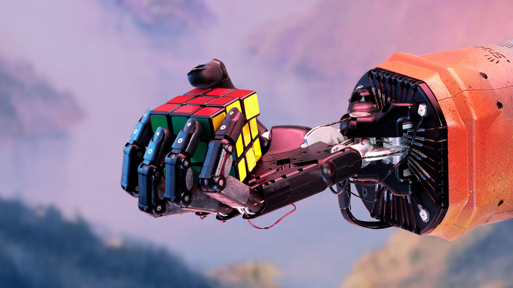
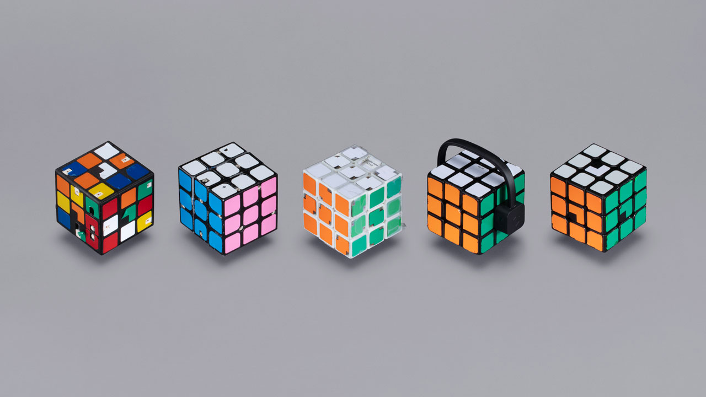

# Solving Rubik’s Cube with a Robot Hand
###### Summary
We've trained a pair of neural networks to solve the Rubik’s Cube with a human-like robot hand.
<!--kg-card-begin: markdown-->

We've trained a pair of neural networks to solve the Rubik’s Cube with a human-like robot hand. The neural networks are trained entirely in simulation, using the same reinforcement learning code as <a href="https://openai.com/blog/openai-five">OpenAI Five</a> paired with a new technique called Automatic Domain Randomization (ADR). The system can handle situations it never saw during training, such as being prodded by a <a href="#perturbations">stuffed giraffe</a>. This shows that reinforcement learning isn't just a tool for virtual tasks, but can solve physical-world problems requiring unprecedented dexterity.

<section class="btns">
<a class="btn btn-padded icon-paper" href="https://arxiv.org/abs/1910.07113">Read paper</a>
<a class="btn btn-padded icon-play" href="https://www.youtube.com/playlist?list=PLOXw6I10VTv9HODt7TFEL72K3Q6C4itG6">Watch all videos</a>
</section>

Human hands let us solve a wide variety of tasks. For the past 60 years of robotics, hard tasks which humans accomplish with their fixed pair of hands have required designing a custom robot for <a href="https://www.guinnessworldrecords.com/world-records/fastest-robot-to-solve-a-rubiks-cube">each task</a>. As an alternative, people have spent <a href="https://www.youtube.com/playlist?list=PLOXw6I10VTv8XX8Qnil18ilSaZvyQ4m2S">many decades trying to use general-purpose robotic hardware</a>, but with limited success due to their high degrees of freedom. In particular, the hardware we use here is not new—the robot hand we use has been around for the last 15 years—but the software approach is.

Since May 2017, we've been trying to train a human-like robotic hand to solve the <a href="https://en.wikipedia.org/wiki/Rubik%27s_Cube">Rubik’s Cube</a>. We set this goal because we believe that successfully training such a robotic hand to do complex manipulation tasks lays the foundation for general-purpose robots. We solved the Rubik’s Cube in simulation in July 2017. But as of July 2018, we could only <a href="https://openai.com/blog/learning-dexterity/">manipulate a block</a> on the robot. Now, we've reached our initial goal.

<!-- uncut video embed -->
<figure class="mt-1 mb-1.5">
<iframe allow="autoplay; encrypted-media" allowfullscreen="" frameborder="0" height="360" src="https://www.youtube.com/embed/kVmp0uGtShk?rel=0&amp;color=white" width="640"></iframe>
<figcaption class="mt-0">A full solve of the Rubik’s Cube. This video plays at real-time and was not edited in any way.</figcaption>
</figure>

Solving a Rubik’s Cube one-handed is a challenging task even for humans, and it takes children several years to gain the dexterity required to master it. Our robot <a href="#challenges">still hasn't perfected its technique</a> though, as it solves the Rubik’s Cube 60% of the time (and only 20% of the time for a <a href="http://cube20.org/qtm/">maximally difficult</a> scramble).

<h2 id="ourapproach">Our approach</h2>

We train neural networks to solve the Rubik’s Cube in <a href="http://mujoco.org/">simulation</a> using <a href="https://openai.com/blog/how-to-train-your-openai-five/">reinforcement learning</a> and <a href="https://en.wikipedia.org/wiki/Optimal_solutions_for_Rubik%27s_Cube#Kociemba's_algorithm">Kociemba’s algorithm</a> for picking the solution steps.<a href="#fn1" id="fnref1">[1]</a> <a href="https://arxiv.org/abs/1703.06907">Domain</a> <a href="https://arxiv.org/abs/1710.06537">randomization</a> enables networks trained solely in simulation to transfer to a real robot.

Domain randomization exposes the neural network to many different variants of the same problem, in this case solving a Rubik’s Cube.

The biggest challenge we faced was to create environments in simulation diverse enough to capture the physics of the real world. Factors like friction, elasticity and dynamics are incredibly difficult to measure and model for objects as complex as Rubik’s Cubes or robotic hands and we found that domain randomization alone is not enough.

To overcome this, we developed a new method called <em>Automatic Domain Randomization</em> (ADR), which endlessly generates progressively more difficult environments in simulation.<a href="#fn2" id="fnref2">[2]</a> This frees us from having an accurate model of the real world, and enables the transfer of neural networks learned in simulation to be applied to the real world.

ADR starts with a single, nonrandomized environment, wherein a neural network learns to solve Rubik’s Cube. As the neural network gets better at the task and reaches a performance threshold, the amount of domain randomization is increased automatically. This makes the task harder, since the neural network must now learn to generalize to more randomized environments. The network keeps learning until it again exceeds the performance threshold, when more randomization kicks in, and the process is repeated.

<!-- ADR visualization -->

<h5 id="adrappliedtothesizeoftherubikscube">ADR applied to the size of the Rubik’s Cube</h5>

One of the parameters we randomize is the size of the Rubik’s Cube (above). ADR begins with a fixed size of the Rubik’s Cube and gradually increases the randomization range as training progresses. We apply the same technique to all other parameters, such as the mass of the cube, the friction of the robot fingers, and the visual surface materials of the hand. The neural network thus has to learn to solve the Rubik’s Cube under all of those increasingly more difficult conditions.

<!-- ADR entropy scatterplot -->

<h5 id="automaticvsmanualdomainrandomization">Automatic vs. manual domain randomization</h5>

Domain randomization required us to manually specify randomization ranges, which is difficult since too much randomization makes learning difficult but too little randomization hinders transfer to the real robot. ADR solves this by automatically expanding randomization ranges over time with no human intervention. ADR removes the need for domain knowledge and makes it simpler to apply our methods to new tasks. In contrast to manual domain randomization, ADR also keeps the task always challenging with training never converging.

We compared ADR to manual domain randomization on the block flipping task, where we already had a <a href="https://openai.com/blog/learning-dexterity">strong baseline</a>. In the beginning ADR performs worse in terms of number of successes on the real robot. But as ADR increases the entropy, which is a measure of the  complexity of the environment, the transfer performance eventually doubles over the baseline—without human tuning.

<h2 id="analysis">Analysis</h2>
<h3 id="testingforrobustness">Testing for robustness</h3>

Using ADR, we are able to train neural networks in simulation that can solve the Rubik’s Cube on the real robot hand. This is because ADR exposes the network to an endless variety of randomized simulations. It is this exposure to complexity during training that prepares the network to transfer from simulation to the real world since it has to learn to quickly identify and adjust to whatever physical world it is confronted with.

<!-- perturbations GIFs -->

<figure class="col-6 col-md-4">
<a class="no-style d-block position-relative" href="https://youtu.be/kVmp0uGtShk">

<iframe allow="autoplay; fullscreen" allowfullscreen="" class="js-custom-lazy" data-id="perturbation-1" data-monitor="" data-src="https://player.vimeo.com/video/365132002?autopause=0&amp;autoplay=0&amp;background=1&amp;loop=1&amp;muted=1&amp;playsinline=1&amp;transparent=1" frameborder="0" height="360" style="cursor:pointer" width="640"></iframe>
</a>
<figcaption class="mt-0">Unperturbed (for reference)</figcaption>
</figure>
<figure class="col-6 col-md-4">
<a class="no-style d-block position-relative" href="https://youtu.be/QyJGXc9WeNo">

<iframe allow="autoplay; fullscreen" allowfullscreen="" class="js-custom-lazy" data-id="perturbation-2" data-monitor="" data-src="https://player.vimeo.com/video/365130786?autopause=0&amp;autoplay=0&amp;background=1&amp;loop=1&amp;muted=1&amp;playsinline=1&amp;transparent=1" frameborder="0" height="360" style="cursor:pointer" width="640"></iframe>
</a>
<figcaption class="mt-0">Rubber glove</figcaption>
</figure>
<figure class="col-6 col-md-4">
<a class="no-style d-block position-relative" href="https://youtu.be/QyJGXc9WeNo?t=24">

<iframe allow="autoplay; fullscreen" allowfullscreen="" class="js-custom-lazy" data-id="perturbation-3" data-monitor="" data-src="https://player.vimeo.com/video/365130801?autopause=0&amp;autoplay=0&amp;background=1&amp;loop=1&amp;muted=1&amp;playsinline=1&amp;transparent=1" frameborder="0" height="360" style="cursor:pointer" width="640"></iframe>
</a>
<figcaption class="mt-0">Tied fingers</figcaption>
</figure>
<figure class="col-6 col-md-4">
<a class="no-style d-block position-relative" href="https://youtu.be/QyJGXc9WeNo?t=48">

<iframe allow="autoplay; fullscreen" allowfullscreen="" class="js-custom-lazy" data-id="perturbation-4" data-monitor="" data-src="https://player.vimeo.com/video/365130697?autopause=0&amp;autoplay=0&amp;background=1&amp;loop=1&amp;muted=1&amp;playsinline=1&amp;transparent=1" frameborder="0" height="360" style="cursor:pointer" width="640"></iframe>
<figcaption class="mt-0">Blanket occlusion and perturbation</figcaption>
</a></figure>
<figure class="col-6 col-md-4">
<a class="no-style d-block position-relative" href="https://youtu.be/QyJGXc9WeNo?t=72">

<iframe allow="autoplay; fullscreen" allowfullscreen="" class="js-custom-lazy" data-id="perturbation-5" data-monitor="" data-src="https://player.vimeo.com/video/365130768?autopause=0&amp;autoplay=0&amp;background=1&amp;loop=1&amp;muted=1&amp;playsinline=1&amp;transparent=1" frameborder="0" height="360" style="cursor:pointer" width="640"></iframe>
</a>
<figcaption class="mt-0">Plush giraffe perturbation</figcaption>
</figure>
<figure class="col-6 col-md-4">
<a class="no-style d-block position-relative" href="https://youtu.be/QyJGXc9WeNo?t=81">

<iframe allow="autoplay; fullscreen" allowfullscreen="" class="js-custom-lazy" data-id="perturbation-6" data-monitor="" data-src="https://player.vimeo.com/video/365130730?autopause=0&amp;autoplay=0&amp;background=1&amp;loop=1&amp;muted=1&amp;playsinline=1&amp;transparent=1" frameborder="0" height="360" style="cursor:pointer" width="640"></iframe>
</a>
<figcaption class="mt-0">Pen perturbation</figcaption>
</figure>

<!-- end .wide -->

Perturbations that we apply to the real robot hand while it solves the Rubik’s Cube. All videos play at real-time.

To test the limits of our method, we experiment with a variety of perturbations while the hand is solving the Rubik’s Cube. Not only does this test for the robustness of our control network but also tests our vision network, which we here use to estimate the cube’s position and orientation.

We find that our system trained with ADR is surprisingly robust to perturbations even though we never trained with them: The robot can successfully perform most flips and face rotations under all tested perturbations, though not at peak performance.

<h3 id="emergentmetalearning">Emergent meta-learning</h3>

We believe that <a href="https://en.wikipedia.org/wiki/Meta_learning_(computer_science)">meta-learning</a>, or learning to learn, is an important prerequisite for building general-purpose systems, since it enables them to quickly adapt to changing conditions in their environments. The hypothesis behind ADR is that a memory-augmented networks combined with a sufficiently randomized environment leads to <em>emergent meta-learning</em>, where the network implements a learning algorithm that allows itself to rapidly adapt its behavior to the environment it is deployed in.<a href="#fn3" id="fnref3">[3]</a>

To test this systematically, we measure the time to success per cube flip (rotating the cube such that a different color faces up) for our neural network under different perturbations, such as resetting the network’s memory, resetting the dynamics, or breaking a joint. We perform these experiments in simulation, which allows us to average performance over 10,000 trials in a controlled setting.

<!-- perturbation charts -->

<button class="js-toggler active button-unstyled small-copy py-0.25 mr-0.5" onclick="toggle(['memory'], ['dynamics','joint'])">Reset memory</button>
<button class="js-toggler button-unstyled small-copy py-0.25 mr-0.5" onclick="toggle(['dynamics'], ['memory', 'joint'])">Reset dynamics</button>
<button class="js-toggler button-unstyled small-copy py-0.25" onclick="toggle(['joint'], ['memory', 'dynamics'])">Broken joint</button>

<figure id="memory">
<h5 class="mt-0 mb-0.5">Time to success when the network’s memory is erased</h5>

</figure>
<figure class="position-absolute w-100" id="dynamics" style="top:0;left:0;opacity:0">
<h5 class="mt-0 mb-0.5">Time to success when friction, mass, or gravity change</h5>

</figure>
<figure class="position-absolute w-100" id="joint" style="top:0;left:0;opacity:0">
<h5 class="mt-0 mb-0.5">Time to success when the robot is impaired by breaking a random joint</h5>

</figure>

In the beginning, as the neural network successfully achieves more flips, each successive time to success decreases because the network learns to adapt. When perturbations are applied (vertical gray lines in the above chart), we see a spike in time to success. This is because the strategy the network is employing doesn't work in the changed environment. The network then relearns about the new environment and we again see time to success decrease to the previous baseline.

We also measure failure probability and performed the same experiments for face rotations (rotating the top face 90 degrees clockwise or counterclockwise) and find the same pattern of adaptation.<a href="#fn4" id="fnref4">[4]</a>

<h3 id="understandingourneuralnetworks">Understanding our neural networks</h3>

Visualizing our networks enables us to understand what they are storing in memory. This becomes increasingly important as the networks grow in complexity.

<!-- hidden state visualization -->
<figure class="mt-1 mb-1.25">
<iframe allow="autoplay; fullscreen" allowfullscreen="" class="js-custom-lazy" data-id="hidden-state" data-monitor="" data-src="https://player.vimeo.com/video/365164292?autopause=0&amp;autoplay=0&amp;background=1&amp;loop=1&amp;muted=1&amp;playsinline=1&amp;transparent=1" frameborder="0" height="360" width="640"></iframe>

<label class="xxsmall-copy mb-0" for="hidden-state-progress" id="hidden-state-progress-label" style="line-height:1">
0:00
</label>
<input id="hidden-state-progress" max="1000" min="0" name="hidden-state-progress" type="range" value="0"/>

</figure>

The memory of our neural network is visualized above. We use a <a href="https://distill.pub/2018/building-blocks/">building block from the interpretability toolbox</a>, namely non-negative matrix factorization, to condense this high-dimensional vector into 6 groups and assign each a unique color. We then display the color of the currently dominant group for every timestep.

We find that each memory group has a semantically meaningful behavior associated with it. For example, we can tell by looking at only the dominant group of the network’s memory if it is about to spin the cube or rotate the top clockwise <em>before it happens</em>.

<h2 id="challenges">Challenges</h2>

Solving the Rubik’s Cube with a robot hand is still not easy. Our method currently solves the Rubik’s Cube 20% of the time when applying a <a href="http://cube20.org/qtm/">maximally difficult scramble</a> that requires 26 face rotations. For simpler scrambles that require 15 rotations to undo, the success rate is 60%. When the Rubik’s Cube is dropped or a timeout is reached, we consider the attempt failed. However, our network is capable of solving the Rubik’s Cube from any initial condition. So if the cube is dropped, it is possible to put it back into the hand and continue solving.

We generally find that our neural network is much more likely to fail during the first few face rotations and flips. This is the case because the neural network needs to balance solving the Rubik’s Cube with adapting to the physical world during those early rotations and flips.

<h3 id="behindthescenesrubikscubeprototypes">Behind the scenes: Rubik’s Cube prototypes</h3>

In order to benchmark our progress and make the problem tractable, we built and designed custom versions of cubes as stepping stones towards ultimately solving a regular Rubik’s Cube.<a href="#fn5" id="fnref5">[5]</a>

<!-- prototypes picture -->

Rubik’s Cube prototypes, from left to right: Locked cube, Face cube, Full cube, <a href="https://www.xiaomitoday.com/xiaomi-giiker-m3-intelligent-rubik-cube-review/">Giiker</a> cube, regular Rubik’s Cube.

<table>
<thead>
<tr>
<th>Prototype</th>
<th>Position + Orientation</th>
<th>Internal Degrees of Freedom (Sensor)</th>
</tr>
</thead>
<tbody>
<tr>
<td>Locked cube</td>
<td>Vision</td>
<td>0 (No sensor)</td>
</tr>
<tr>
<td>Face cube</td>
<td><a href="http://phasespace.com/">PhaseSpace</a></td>
<td>2 (PhaseSpace)</td>
</tr>
<tr>
<td>Full cube</td>
<td>PhaseSpace</td>
<td>6 (PhaseSpace)</td>
</tr>
<tr>
<td>Giiker cube</td>
<td>Vision</td>
<td>6 (<a href="https://www.xiaomitoday.com/xiaomi-giiker-m3-intelligent-rubik-cube-review/">Built-in sensors</a>)</td>
</tr>
<tr>
<td>Regular Rubik’s Cube</td>
<td>Vision</td>
<td>6 (Vision)</td>
</tr>
</tbody>
</table>

<!-- end .content .row .container .full -->
<h2 id="nextsteps">Next steps</h2>

We believe that human-level dexterity is on the path towards building general-purpose robots and we are excited to push forward in this direction.

<em>If you want to help make increasingly general AI systems, whether robotic or virtual, <a href="https://openai.com/jobs/#robotics">we're hiring</a>!</em>

<footer class="post-footer js-post-footer">
<!-- footer item -->

Acknowledgments

Thanks to the following for feedback on drafts of this post and paper: Josh Achiam, Greg Brockman, Nick Cammarata, Jack Clark, Jeff Clune, Ruben D’Sa, Harri Edwards, David Farhi, Ken Goldberg, Leslie P. Kaelbling, Hyeonwoo Noh, Lerrel Pinto, John Schulman, Ilya Sutskever &amp; Tao Xu.

<!-- footer item -->

Video

Peter Jordan (Director), Yvette Solis (Producer), Brooke Chan (Producer)

<!-- footer item -->

Editor

Ashley Pilipiszyn

<!-- footer item -->

Design

Justin Jay Wang &amp; Ben Barry

<!-- footer item -->

Photography

Eric Haines

<!-- special footer item for footnotes -->

Footnotes

<section class="footnotes">
<ol class="footnotes-list">
<li class="footnote-item" id="fn1">
We focus on the problems that are currently difficult for machines to master: perception and dexterous manipulation. We therefore train our neural networks to achieve the required face rotations and cube flips as generated by Kociemba’s algorithm. <a class="footnote-backref" href="#fnref1">↩︎</a>

</li>
<li class="footnote-item" id="fn2">
Our work is strongly related to <a href="https://arxiv.org/abs/1901.01753">POET</a>, which automatically generates 2D environments. However, our work learns a joint policy over all environments, which transfers to any newly generated environment. <a class="footnote-backref" href="#fnref2">↩︎</a>

</li>
<li class="footnote-item" id="fn3">
More concretely, we hypothesize that a neural network with finite capacity trained on environments with unbounded complexity forces the network to learn a special-purpose learning algorithm since it cannot memorize solutions for each individual environment and there exists no single robust policy that works under all randomizations. <a class="footnote-backref" href="#fnref3">↩︎</a>

</li>
<li class="footnote-item" id="fn4">
Please refer to our <a href="https://arxiv.org/abs/1910.07113">paper</a> for full results. <a class="footnote-backref" href="#fnref4">↩︎</a>

</li>
<li class="footnote-item" id="fn5">
The only modification we made was cutting out a small piece of each center cublet’s colorful sticker. This was necessary to break <a href="https://en.wikipedia.org/wiki/Rotational_symmetry">rotational symmetry</a>. <a class="footnote-backref" href="#fnref5">↩︎</a>

</li>
</ol>
</section>
<!--kg-card-end: markdown-->

</footer>