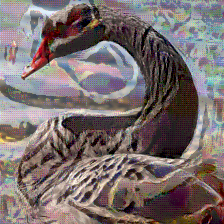
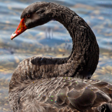
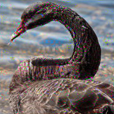
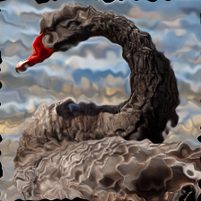
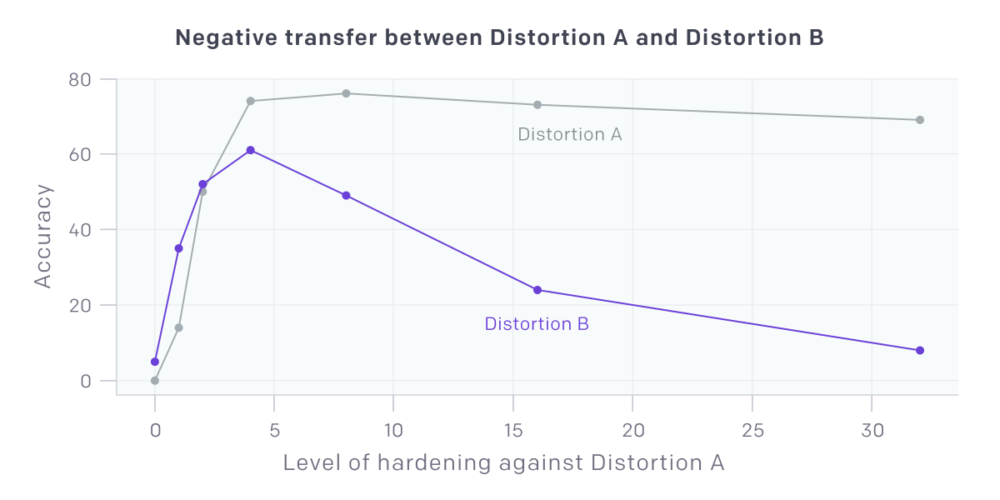
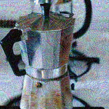
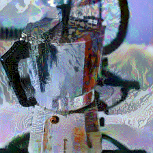
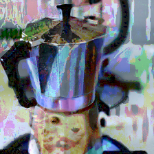
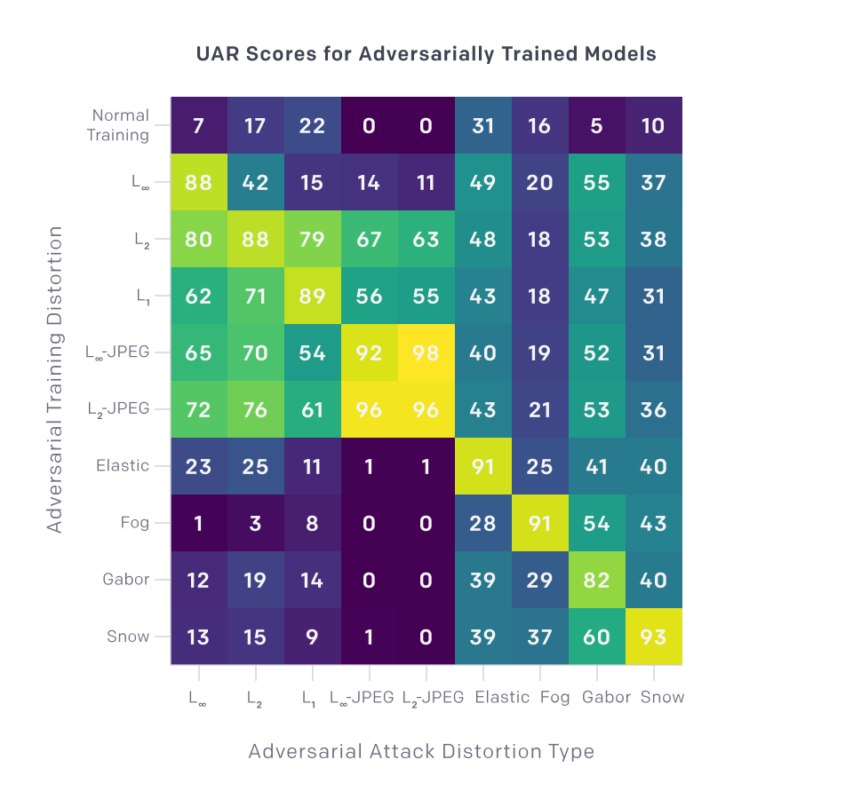

# Testing Robustness Against Unforeseen Adversaries
###### Summary
<!--kg-card-begin: markdown-->

We've developed a method to assess whether a neural network classifier can reliably defend against adversarial attacks not seen during training. Our method yields a new metric, UAR (Unforeseen Attack Robustness), which evaluates the robustness of a single model against an unanticipated attack, and highlights the need to measure performance

<!--kg-card-begin: markdown-->

We've developed a method to assess whether a neural network classifier can reliably defend against adversarial attacks not seen during training. Our method yields a new metric, UAR (Unforeseen Attack Robustness), which evaluates the robustness of a single model against an unanticipated attack, and highlights the need to measure performance across a more diverse range of unforeseen attacks.

<section class="btns"><a class="btn btn-padded icon-paper" href="http://arxiv.org/abs/1908.08016" target="blank">Read Paper</a><a class="btn btn-padded icon-code" href="https://github.com/ddkang/advex-uar" target="blank">View Code</a></section>

Modern neural networks have achieved high accuracies on a wide range of benchmark tasks. However, they remain susceptible to <em><a href="https://openai.com/blog/adversarial-example-research/">adversarial examples</a></em>, small but carefully crafted distortions of inputs created by adversaries to fool the networks. For example, the adversarial example with $L_\infty$ distortion below differs from the original image by at most 32 in each RGB pixel value; a human can still classify the changed image, but it is confidently misclassified by a standard neural network.

Sample images (black swan) generated by adversarial attacks with different distortion types. Each distortion is optimized to fool the network.

$L_\infty$: each pixel value may be changed by at most 32.

$L_1$: the vector of pixel values may be changed by a vector bounded in $L_1$-norm.

$L_2$-JPEG: image is trans­formed to a JPEG-com­pressed vector and distorted.

Elastic: a flow along a local vector field is applied to the image.

Fog: a fog-like distortion of bounded magnitude is applied to the image.

Gabor: additive noise is added to adversarially texture the image.

Snow: snowflakes are adversarially constructed to partially obscure the image.

<!-- end .row -->

<!-- end .wide -->

AI systems deployed in the wild will need to be robust to unforeseen attacks, but most defenses so far have focused on specific known attack types. The field has made progress in hardening models against such attacks; however, robustness against one type of distortion <a href="https://arxiv.org/abs/1712.02779">often</a> <a href="https://arxiv.org/abs/1709.04114">does</a> <a href="https://arxiv.org/abs/1903.10484">not</a> <a href="https://arxiv.org/abs/1902.08265">transfer</a> <a href="https://arxiv.org/abs/1904.13000">to</a> robustness against attacks unforeseen by designers of the model. Consequently, evaluating against only a single distortion type can give a false sense of security about a model in the wild which may remain vulnerable to unforeseen attacks such as <a href="https://dl.acm.org/citation.cfm?id=2978392">fake eyeglasses</a> and <a href="https://arxiv.org/abs/1712.09665">adversarial stickers</a>.

<figure class="my-1.5">

<figcaption>

An example where adversarial robustness does not transfer well. Hardening a model against Distortion A initially increases robustness against both Distortions A and B. However, as we harden further, adversarial robustness is harmed for Distortion B but remains about the same for Distortion A.<a href="#fn1" id="fnref1">[1]</a> (A = $L_\infty$, B = $L_1$)

</figcaption>
</figure>
<h3 id="methodprinciples">Method principles</h3>

We’ve created a three-step method to assess how well a model performs against a new held-out type of distortion. Our method evaluates against diverse unforeseen attacks at a wide range of distortion sizes and compares the results to a strong defense which has knowledge of the distortion type. It also yields a new metric, UAR, which assesses the adversarial robustness of models against unforeseen distortion types.

<h4 id="1evaluateagainstdiverseunforeseendistortiontypes">1. Evaluate against diverse unforeseen distortion types</h4>

Typical papers on adversarial defense evaluate only against the widely studied $L_\infty$ or $L_2$ distortion types. However, we <a href="http://arxiv.org/abs/1908.08016">show</a> that evaluating against the $L_p$ distortions gives very similar information about adversarial robustness.<a href="#fn2" id="fnref2">[2]</a> We conclude that evaluating against $L_p$ distortions is insufficient to predict adversarial robustness against other distortion types. Instead, we suggest that researchers evaluate models against adversarial distortions that are not similar to those used in training. We offer the $L_1$, $L_2$-JPEG, Elastic, and Fog attacks as a starting point. We provide implementations, pre-trained models, and calibrations for a variety of attacks in our <a href="https://github.com/ddkang/advex-uar">code package</a>.

<h4 id="2chooseawiderangeofdistortionsizescalibratedagainststrongmodels">2. Choose a wide range of distortion sizes calibrated against strong models</h4>

We found that considering too narrow a range of distortion sizes can reverse qualitative conclusions about adversarial robustness. To pick a range, we examine images produced by an attack at different distortion sizes and choose the largest range for which the images are still human-recognizable. However, as shown below, an attack with a large distortion budget only uses it against strong defenses. We recommend choosing a calibrated range of distortion sizes by evaluating against adversarially trained models (we also provide calibrated sizes for a wide variety of attacks in our <a href="https://github.com/ddkang/advex-uar">code package</a>).

<figure class="my-1.5">

Sample images (espresso maker) of the same strong attack applied to different defense models. Attacking stronger defenses causes greater visual distortion.

Undefended

Weakly defended

Strongly defended

</figure>
<h4 id="3benchmarkadversarialrobustnessagainstadversariallytrainedmodels">3. Benchmark adversarial robustness against adversarially trained models</h4>

We developed a new metric, UAR, which compares the robustness of a model against an attack to adversarial training against that attack. Adversarial training is a strong defense that uses knowledge of an adversary by training on adversarially attacked images.<a href="#fn3" id="fnref3">[3]</a> A UAR score near 100 against an unforeseen adversarial attack implies performance comparable to a defense with prior knowledge of the attack, making this a challenging objective.

We computed the UAR scores of adversarially trained models for several different distortion types. As shown below, the robustness conferred by adversarial training does not transfer broadly to unforeseen distortions. In fact, robustness against a known distortion can reduce robustness against unforeseen distortions. These results underscore the need for evaluation against significantly more diverse attacks like Elastic, Fog, Gabor, and Snow.

<figure>

<figcaption>UAR scores for adversarially trained models against adversarial attacks with different distortion types.</figcaption>
</figure>
<h3 id="nextsteps">Next steps</h3>

We hope that researchers developing adversarially robust models will use our methodology to evaluate against a more diverse set of unforeseen attacks. Our <a href="https://github.com/ddkang/advex-uar">code</a> includes a suite of attacks, adversarially trained models, and calibrations which allow UAR to be easily computed.

<em>If you're interested in topics in AI Safety, consider <a href="https://openai.com/jobs">applying</a> to work at OpenAI.</em>

<footer class="post-footer js-post-footer">
<!-- footer item -->

Acknowledgments

Thanks to the following for feedback on this post: Dario Amodei, Preetum Nakkiran, Jacob Hilton, Nicholas Carlini, Florian Tramèr, Logan Engstrom, and Nicolas Papernot

<!-- special footer item for footnotes -->

Footnotes

<section class="footnotes">
<ol class="footnotes-list">
<li class="footnote-item" id="fn1">
The accuracy of the model against Distortion A peaks at a hardening level of 8 because that is sufficient to defend against the attack and further hardening hurts clean accuracy; see full paper for details. <a class="footnote-backref" href="#fnref1">↩︎</a>

</li>
<li class="footnote-item" id="fn2">
The $L_p$ distortion allows an image viewed as a vector $x$ of pixel values to be distorted to a vector $x^\prime$ such that $x$ and $x^\prime$ are close in the <a href="https://en.wikipedia.org/wiki/Lp_space">$L_p$ norm</a>. <a class="footnote-backref" href="#fnref2">↩︎</a>

</li>
<li class="footnote-item" id="fn3">
To compute UAR, we average the accuracy of the defense across multiple distortion sizes and normalize by the performance of an adversarially trained model; a precise definition is in our paper. <a class="footnote-backref" href="#fnref3">↩︎</a>

</li>
</ol>
</section>
<!--kg-card-end: markdown-->

</footer>